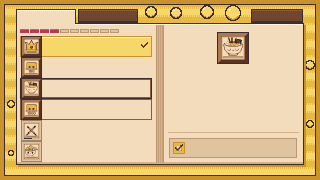
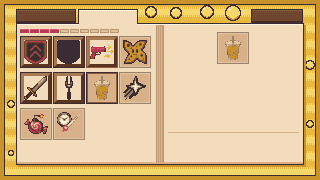

# Erfolge- / Unlocks-Buch — Pixel-UI

Aufgeschlagenes Kochbuch, das in der gelben Kapselflüssigkeit schwebt. Geht auf,
wenn der Spieler an der gelben Kapsel mit dem Buch **E** drückt.

Native Auflösung **320x180**, im Spiel 4x hochskaliert. Alle Maße in dieser Datei
sind echte Pixel auf 320x180-Basis, Ursprung **oben links**.

**In den Sprites steht kein einziger Buchstabe.** Alle Beschriftungen, Titel und
Fortschrittszahlen kommen in Unity als TextMeshPro darüber. Die dafür frei
gelassenen Flächen stehen unten in der Textzonen-Tabelle.





---

## 1. Dateien

```
Tools/
  erfolgsbuch_ui.py               **Quelle der 26 Sprites** - zeichnet sie,
                                  packt den Atlas, ruft die Vorschau auf
  erfolgsbuch_vorschau.py         baut preview_filled*.png aus den Sprites

Assets/Art/UI_Objects/AchievementsBook/
  achievements_book.aseprite      erster Entwurf von Hand, 13 Layer, 2 Frames,
                                  34 Slices - **nicht** mehr der aktuelle Stand
  achievements_book.gpl           Palette (14 Kern- + 7 Akzentfarben)
  preview_page_1.png              Mockup Zustand A (Reiter 1 aktiv)
  preview_page_2.png              Mockup Zustand B (Reiter 2 aktiv, Kachelgitter)
  preview_filled.png              Mockup Erfolge mit echten Icons (Referenz)
  preview_filled_unlocks.png      Mockup Unlocks mit echten Icons (Referenz)
  ACHIEVEMENTS_BOOK_UI.md         diese Datei
  atlas/achievements_book_atlas.png   512x368 Sprite-Sheet
  atlas/achievements_book_atlas.json  JSON Hash inkl. 9-Slice-Centern

Assets/Resources/AchievementsBook/
  ui/                             26 Einzel-PNGs, transparent, 1:1, je mit .meta
  <iconKey>_12/_21/_32.png        84 umgefärbte Icons (siehe Abschnitt 8)

Assets/Art/World-Objects/
  kapsel_erfolgsbuch.png          32x48, PPU 32 - das Weltobjekt (Abschnitt 10)

Assets/Scripts/Achievements/
  UI/AchievementsBookPanel.cs     das Fenster, baut sich per Code auf
  AchievementsBookTrigger.cs      [E] an der Kapsel
```

> Die Runtime-Sprites liegen unter **Resources**, weil sich das Fenster wie
> `AchievementPanel` und `UnlockPanel` komplett per Code aufbaut und deshalb
> nichts über den Inspector verdrahtet bekommt. Palette, Vorschauen und Atlas
> bleiben im Art-Ordner.

> **Ändern geht über das Skript, nicht über die PNGs.** Ein Lauf von
>
> ```
> python Tools/erfolgsbuch_ui.py
> ```
>
> schreibt alle 26 PNGs neu, packt sie in genau die Rechtecke, die schon im
> Atlas-JSON stehen, und baut die beiden Vorschauen daraus. Die `.meta`-Dateien
> fasst es nicht an - GUIDs, 9-Slice-Ränder und Importeinstellungen bleiben, und
> `AchievementsBookPanel.cs` braucht keine Zeile Änderung.
>
> `achievements_book.aseprite` ist der erste, von Hand gezeichnete Entwurf. Die
> ausgelieferten Sprites stammen seit der Überarbeitung aus dem Skript; wer die
> Datei in Aseprite öffnet, sieht also den alten Stand.

### Sprite-Liste

| Sprite | Größe | Funktion in `erfolgsbuch_ui.py` |
|---|---|---|
| `bg_capsule` | 320x180 | `bg_capsule()` |
| `bubble_01` … `bubble_08` | 6, 8, 8, 10, 12, 12, 14, 16 (quadratisch) | `bubble(d)` |
| `book_panel` | 290x144 | `book_panel()` — Korpus 288x142 plus 2px Schlagschatten |
| `book_spine` | 8x138 | `book_spine()` |
| `tab_active` | **60x16** | `tab_active()` — 2px höher als der inaktive, siehe 5.2 |
| `tab_inactive` | 60x14 | `tab_inactive()` — auch der Zurück-Knopf, auf 52px gestaucht |
| `row_normal` | 132x21 | `row_normal()` (nur die Linierung, siehe 5.3) |
| `row_selected` | 132x21 | `row_selected()` (nur Rahmen, siehe 5.3) |
| `row_done` | 132x21 | `row_done()` (goldene Fläche) |
| `row_hover` | 132x21 | `row_hover()` (dünner Rahmen, Maus liegt drauf) |
| `progress_cell_full` | 9x4 | `progress_cell_full()` |
| `progress_cell_empty` | 9x4 | `progress_cell_empty()` |
| `slot_small_unlocked` | **21x21** | `slot_unlocked(21)` — der Slot in der Listenzeile |
| `slot_small_locked` | **21x21** | `slot_locked(21)` |
| `slot_large_unlocked` | **32x32** | `slot_unlocked(32)` — Detailseite (Erfolge) |
| `slot_large_owned` | **32x32** | `slot_unlocked(32, owned=True)` — Unlocks, die man hat |
| `slot_large_locked` | **32x32** | `slot_locked(32)` |
| `reward_box` | 128x20 | `reward_box()` |
| `icon_locked` | 12x12 | `icon_locked()` |

> „small“ und „large“ sind relativ gemeint: der Listen-Slot ist 21x21, der
> Detail-Slot 32x32. Die Namen stammen aus der ersten Fassung und bleiben,
> damit bestehende Referenzen nicht brechen.

---

## 2. Palette

Kernpalette, exakt wie vorgegeben:

| Hex | Verwendung |
|---|---|
| `#f2dcbc` | Pergament, Buchseite, aktiver Reiter |
| `#e0c49f` | Belohnungs-Box, leere Fortschrittszelle |
| `#d9b189` | Seitenschatten unten, Buchrücken-Streifen, Trennlinie, gesperrter Slot |
| `#b99772` | Buchrücken-Kanten, Rahmen der Belohnungs-Box, gedämpfte Icons |
| `#8c5a3c` | Holz — Icon-Slot-Grundton, innerer Auswahlrahmen |
| `#6f4630` | Holz dunkel — inaktiver Reiter, Fließtext |
| `#5a3421` | Icon-Slot-Schatten, Haken auf der erledigten Zeile |
| `#4d2e1e` | Reiter-Schatten unten, Titel auf der erledigten Zeile |
| `#3b2b33` | Kontur, durchgehend 1px; äußerer Auswahlrahmen |
| `#b83a52` | gefüllte Fortschrittszelle |
| `#e8b93c` | Kapselgelb — Hintergrund, Belohnungs-Slot |
| `#c9922a` | Kapselrahmen, Schlagschatten des Buchs, Rahmen der erledigten Zeile |
| `#f7d76a` | Kapselgelb hell — Bänderung, Blasenfüllung, **Fläche „erledigt“** |
| `#fff4e0` | 1px Highlight oben (Seite, Reiter, Blase, erledigte Zeile) |

**Zusätzlich 7 Akzente.** Fünf verlangt die Element-Spezifikation namentlich,
ohne dass sie in der 14er-Liste stehen: `#c8a078` (Buchrücken), `#a87a52`
(Slot-Highlight), `#8a5a3d` (Reiter-Highlight), `#9c8268` (Slot gesperrt,
Kontur), `#d4566c` (Fortschrittszelle, Highlight).

Zwei sind bei der Überarbeitung dazugekommen, weil Gold und Rot sonst keinen
dunklen Fuß haben und jede Fase am unteren Rand ins Nichts läuft:

| Hex | Verwendung |
|---|---|
| `#a8761f` | Gold-Fuß: Kapselrahmen unten/rechts, Boden des Flüssigkeitsverlaufs, Fassung der Belohnungsbox |
| `#8e2a3e` | Rot-Fuß: unterste Zeile und Seitenkanten der gefüllten Fortschrittszelle |

**Zusammen 21 Farben, und keine mehr** - die 25 Sprites lassen sich damit
nachzählen (`Farben gesamt: 21`). Alle liegen in `achievements_book.gpl`.

---

## 3. Seitenaufbau (320x180)

| Element | x | y | b | h |
|---|---|---|---|---|
| Kapselhintergrund | 0 | 0 | 320 | 180 |
| Kapsel-Innenfläche (hinter dem Rahmen) | 5 | 5 | 310 | 170 |
| Reiter 1 | 16 | 9 | 60 | 14 (aktiv **16**) |
| Reiter 2 | 78 | 9 | 60 | 14 (aktiv **16**) |
| Zurück-Knopf | 251 | 9 | 52 | 14 |
| Buchseite (Korpus) | 16 | 23 | 288 | 142 |
| Buchseite inkl. Schlagschatten (= `book_panel`) | 16 | 23 | 290 | 144 |
| Buchrücken | 156 | 25 | 8 | 138 |
| linke Seite, Innenfläche | 17 | 25 | 139 | 137 |
| rechte Seite, Innenfläche | 164 | 25 | 139 | 137 |
| Fortschrittsleiste (10 Zellen) | 20 | 29 | 99 | 4 |
| Zähler neben der Leiste | 121 | 26 | 34 | 10 |
| Listen-Viewport (Erfolge) | 20 | 36 | 132 | 126 |
| Kachelgitter (Unlocks), gleiches Sichtfenster | 20 | 36 | 132 | 126 |
| großer Icon-Rahmen | **224** | 32 | 32 | 32 |
| Trennlinie `#d9b189` | **182** | 132 | **117** | 1 |
| Belohnungs-Box (9-Slice, nativ 128 breit) | **182** | 138 | **117** | 20 |

**Sichere Innenfläche des Buchs:** y = 25..161. Zeile 24 ist das 1px-Highlight,
Zeile 162/163 der 2px-Schatten, Zeile 164 die Kontur.

Der aktive Reiter hängt an der Seite: er ist **16px hoch statt 14** und reicht
damit bis y=24, deckt also die Konturzeile (y=23) und die Lichtkante (y=24) der
Buchseite zu. `book_panel` behält dadurch eine geschlossene Oberkante — die
Lücke entsteht erst durch den Reiter, der darüber liegt.

`AchievementsBookPanel.Rebuild()` setzt die Höhe bei jedem Reiterwechsel:
`sizeDelta = (TabW, active ? TabH + TabOverlap : TabH)`. Der Anker sitzt oben
links, der Reiter wächst also nach unten und die Beschriftung bleibt stehen.

---

## 4. Textzonen

Alle Angaben in 320x180-Pixeln. „max. Zeichen“ gilt für einen **5x7-Font mit 1px
Laufweite** (6px Vorschub je Glyphe, also `floor((b+1)/6)`).

| Name | x | y | b | h | Ausrichtung | Zeilen | max. Zeichen |
|---|---|---|---|---|---|---|---|
| `text_tab_1` („ERFOLGE“) | 18 | 11 | 56 | 10 | zentriert | 1 | 9 |
| `text_tab_2` („UNLOCKS“) | 80 | 11 | 56 | 10 | zentriert | 1 | 9 |
| `text_back` („ZURUECK“) | 253 | 11 | 48 | 10 | zentriert | 1 | 8 |
| `text_counter` („7 / 41“) | 121 | 26 | 34 | 10 | rechts | 1 | 5 |
| `text_row_title` | 45 | 38 | 94 | 10 | links | 1 | 15 |
| `text_row_progress` | 45 | 47 | 94 | 9 | links | 1 | 15 |
| `text_detail_title` | **182** | 67 | **117** | 14 | zentriert | 1 | 19 |
| `text_detail_desc` | **182** | 84 | **117** | 34 | links | 3 | 19 je Zeile (57) |
| `text_detail_progress` | **182** | 120 | **117** | 9 | zentriert | 1 | 19 |
| `text_reward` | **202** | 141 | **93** | 14 | links | 2 | 15 je Zeile |

`text_row_title` / `text_row_progress` stehen hier für **Zeile 0**. Zeilen-lokal
sind sie `(25, 2, 94, 10)` und `(25, 11, 94, 9)`; die globale y ergibt sich aus
`36 + Zeilenindex * 21`.

> **Der Titel sitzt zeilen-lokal bei y=2, nicht bei y=1.** `row_selected` liegt
> als letztes Kind über dem Text und hat bei y=1 seine Innenkante. Die Punkte
> über einem Ä, Ö oder Ü stehen ganz oben in der Zeile und kämen ihr sonst ins
> Gehege. 10 ist immer noch größer als die Schriftgröße 8 — siehe den Kasten
> darunter.

Die ganze **Detailspalte hängt an `DetailLeft = 182` und `DetailW = 117`** in
`AchievementsBookPanel.cs`. Sie begann früher bei 168 und damit mitten im
Falzschatten der rechten Seite: die ersten Zeichen jeder Zeile standen sichtbar
auf dunklerem Papier. Der Falz endet jetzt bei x=179 (`GUTTER = 15` in
`Tools/erfolgsbuch_ui.py`), der Text setzt 3px danach an. Titel, Beschreibung,
Fortschritt, Trennlinie und Belohnungsbox stehen alle auf dieser Kante, und der
große Icon-Rahmen sitzt mit x=224 genau in der Mitte der Spalte.

> **Wichtig und schon einmal reingefallen:** die Höhe einer Textzone muss
> **größer sein als die Schriftgröße**. Ist das Rechteck zu flach, wirft
> TextMeshPro die Zeile still weg und es steht gar nichts da — genau deshalb
> fehlten in der ersten Fassung die Titel in der Liste (7px Rechteck bei
> Schriftgröße 8). Alle Zonen oben haben jetzt Luft.

**Schriftgrößen** in der Projektkonvention: Titel `12`, Fließtext `8`,
Kleintext `6`.

> **Umlaute:** ThaleahFat hat 116 Glyphen und darunter kein Ä, Ö, Ü oder ß.
> Deutscher Text musste deshalb „ZURUECK" und „Glueckwunsch" schreiben.
> Jersey10 liegt im selben Stil vor, ist auf `AtlasPopulationMode: Dynamic`
> importiert und rendert die Umlaute bei Bedarf aus der TTF nach.
>
> Die Auswahl steht jetzt einmal in **`PixelUI.FindTextFont()`** (Jersey10
> zuerst, ThaleahFat als Rückfall) und wird von diesem Fenster, von
> `AchievementPanel` und von `UnlockPanel` benutzt. Alle drei zeigen dieselben
> Katalogtexte — hätte nur eines davon umgestellt, stünden in den anderen
> Kästchen statt Buchstaben.
>
> In `de.json` stehen seitdem **echte Umlaute**: `ZURÜCK`, `Glückwunsch`,
> `Krümelbrecher`, `höchste`, `Erhöht`, `verfügbar`, `Plätze`, `Stärke`,
> `Rüstung`, `Münzgewinn`, `käuflich`, `höchstpersönlich`. Nicht angefasst
> wurden Wörter, in denen das ss/ue/ae richtig ist: `Boss`, `Extraschuss`,
> `Feuerball`, `Himmelsstern`, `Wirkdauer`, `Glass Cannon`.

---

## 5. Elemente im Detail

### 5.1 Hintergrund und Blasen

- `bg_capsule`: die Flüssigkeit ist ein **gedithertes Gefälle** über die Rampe
  `#f7d76a → #e8b93c → #c9922a → #a8761f`, von oben hell nach unten satt. Die
  Schichtgrenzen schwingen leicht (zwei überlagerte Sinus, ±5px) — waagrecht
  schnurgerade sah aus wie eine Wand, nicht wie Flüssigkeit. Darüber liegen zwei
  diagonale Scheinbänder (Glas), rund 110 einzelne hellere Schwebeteilchen und
  eine Vignette, die zum Rand hin eine Stufe abdunkelt.
  Rahmen außen 4px Messing mit Fase (`#f7d76a → #e8b93c → #c9922a → #a8761f`
  nach innen, unten/rechts umgekehrt), direkt innen 1px Kontur `#3b2b33`. In den
  vier Ecken sitzt je eine 3x3-Schraube. Als **9-Slice** (Rand 5) eingebunden.

  > **Warum Verlauf statt fester 8px-Bänder:** auf 16:9 ist die Canvas exakt
  > 320x180 und nichts wird gedehnt, auf allem anderen schon. Ein Verlauf hält
  > das aus, feste Bänder werden dabei unterschiedlich dick. Aus demselben Grund
  > sitzen die Schrauben **nur in den Ecken** — in der Mitte einer Kante würde
  > das 9-Slice sie verschmieren.

- `bubble_01..08`: **runde** Blasen, 6 bis 16px Durchmesser. 1px Kontur
  `#3b2b33`, Füllung `#f7d76a`, Innenkante oben links eine Stufe dunkler
  (`#e8b93c`) — erst dadurch hebt sich der Glanzpunkt `#fff4e0` überhaupt ab.
  Ab 9px kommt unten rechts eine Brechungssichel in `#fff4e0` dazu; die macht
  aus dem Kreis erst eine Blase. Harte Kanten, kein Anti-Aliasing — die Rundung
  entsteht nur über den Radius.
- **Bewegung:** Die Blasen steigen ausschließlich in den Streifen **links und
  rechts neben dem Buch** auf, nicht über die ganze Breite. In der Mitte wären
  sie hinter dem Buch und würden bloß am Buchrand auftauchen und wieder
  verschwinden — das sah unlogisch aus. Große Blasen sind langsamer (5 px/s)
  als kleine (11 px/s), dazu eine leichte Sinus-Drift von ±1–2px.
- **Zur Laufzeit laufen nur `bubble_01..04`** (6 bis 10px). Bei 320px Breite ist
  so ein Seitenstreifen nur 11px schmal — eine 16er Blase würde über den
  Kapselrahmen laufen. Die Startposition rechnet mit dem Radius, damit keine
  Blase den Rahmen oder die Buchkante überläuft. `bubble_05..08` bleiben
  exportiert und sind für breitere Seitenverhältnisse da; im Mockup liegen sie
  nur im freien Stück der Reiterzeile, damit man sie ausschneiden kann.

### 5.1b Buchseite und Bund

Die Doppelseite ist nicht nur eine helle Fläche. Von außen nach innen:

| Was | Aufbau |
|---|---|
| Kontur | 1px `#3b2b33` rundum, darunter 1px Lichtkante `#fff4e0` |
| Seitenstapel | an beiden Außenkanten 2px (`#e0c49f`, `#d9b189`) — die Kanten der Blätter darunter |
| **Wölbung zum Bund** | beide Seiten laufen über `GUTTER = 15`px zur Mitte in den Schatten: gedithert `#f2dcbc → #e0c49f`, die letzten 4px fest `#e0c49f`, der letzte 1px `#d9b189` |
| Seitenschatten unten | 2px `#d9b189` (Zeile 162/163 global) |
| Papierfaser | rund 520 einzelne Pixel, eine Stufe hell oder dunkel — mehr, und die Seite sieht verrauscht aus statt nach Papier |
| Schlagschatten des Icon-Rahmens | 2px nach unten rechts am Rahmen bei lokal (208,9,32,32): 1px `#d9b189` innen, 1px `#e0c49f` außen |
| Zierlinien | zwei gravierte Striche links und rechts neben dem Icon-Rahmen, lokal y=24/25, je 28px lang mit 4px Luft zum Rahmen und 3px-Endkappe |
| Schlagschatten des Buchs | 2px `#c9922a` nach unten rechts, im Sprite enthalten |

Die Wölbung ist das, was aus zwei Rechtecken ein aufgeschlagenes Buch macht.
Sie läuft auch hinter der Liste durch — die Zeilen sind bis auf `row_done`
durchsichtig, und die Textzone endet bei lokal x=123, also lange vor dem
dunkelsten Streifen.

> **`GUTTER` war 18 und ist jetzt 15**, und die dunkelste Stufe ist von 2px auf
> 1px geschrumpft. Mit 18 reichte der Falzschatten der rechten Seite bis global
> x=182 und damit über den Anfang des Detailtextes hinaus: die ersten Zeichen
> jeder Zeile standen auf sichtbar dunklerem Papier. Beides zusammen — engerer
> Falz *und* Textspalte ab x=182 — löst das, ohne dass die Seite ihre Wölbung
> verliert.

Der **Schlagschatten des Icon-Rahmens** darf fest ins Papier, weil der Rahmen
bei (224,32,32,32) immer steht: `AchievementsBookPanel` blendet nur das Icon
darin aus, nie den Rahmen selbst. Im Skript hängt er an `SLOT_X/SLOT_Y/SLOT_S`,
die Zierlinien ebenfalls — wird der Rahmen verschoben, wandert beides mit.

Die **Zierlinien** füllen die einzige wirklich freie Fläche der rechten Seite —
neben dem Icon-Rahmen, oberhalb von y=44, wo der Titel anfängt. Sie liegen
symmetrisch um die Mitte des Rahmens und weit genug vom Bund weg, dass sie nicht
im Falzschatten verschwinden. Auf der linken Seite ist kein Platz dafür, dort
klebt die Liste am Seitenrand.

`book_spine` ist ein Lederrücken: dunkle Kante an beiden Falzen, dazwischen eine
Wölbung ins Licht (`#6f4630 → #a87a52 → #c8a078 → #a87a52 → #8c5a3c → #5a3421`),
dazu drei **Bünde** bei y=34/69/104 — obere Kante eine Stufe heller, untere eine
Stufe dunkler, wie die erhabenen Rippen auf einem gebundenen Buch. Oben und
unten je eine Kappe, damit der Rücken nicht offen ausläuft.

> Der erste Entwurf hatte hier einen durchlaufenden Heftfaden und ein
> gestreiftes Kapitalband. Auf 8px Breite las sich beides als Leiter, nicht als
> Buch. Drei Bünde sagen dasselbe und sind ruhig genug, dass der Blick über den
> Bund hinweggeht statt daran hängen zu bleiben.

### 5.2 Reiter

| Zustand | Aufbau |
|---|---|
| `tab_active` | Füllung `#f2dcbc`, Kontur `#3b2b33` oben/links/rechts, 1px Highlight `#fff4e0` oben **und** an der linken Kante, rechte Kante 1px `#e0c49f`, **unten offen** |
| `tab_inactive` | Querbänder `#8a5a3d` → `#6f4630` → `#5a3421` → `#4d2e1e` von oben nach unten, Kontur rundum, linke Kante `#8a5a3d`, rechte `#4d2e1e`, Ecken abgerundet |

> **Nur waagrechte Bänder im inaktiven Reiter.** Dasselbe Sprite wird als
> Zurück-Knopf auf 52px gestaucht; eine senkrechte Maserung oder ein Dither in
> der Mitte würde dabei ungleichmäßig skaliert. Durchgehende Zeilen überstehen
> das sauber.

> **`tab_active` ist 60x16, `tab_inactive` 60x14.** Die zwei zusätzlichen Zeilen
> sind der Überstand auf die Buchseite (Abschnitt 3). Die Seitenkonturen laufen
> bis ganz unten durch, die Füllung nicht — so trifft die Reiterwand sauber auf
> die Oberkante der Seite, und dazwischen bleibt keine dunkle Linie stehen.
> Ohne den Überstand schwebt der aktive Reiter als eigene Karte über dem Buch;
> das war der auffälligste Fehler der ersten Fassung.

Der **Zurück-Knopf** rechts in derselben Zeile benutzt dasselbe
`tab_inactive`-Sprite, nur als 9-Slice auf 52x14 gezogen: rechte Kante bündig
mit dem Buch, gleiche Höhe wie die Reiter. Beim Überfahren legt sich derselbe
`row_hover`-Rahmen darüber wie bei Zeilen und Kacheln. Beschriftung über den
vorhandenen Schlüssel `ui.achievements.close` — der steht schon in beiden
Sprachdateien, deutsch bewusst **„ZURUECK“ ohne Umlaut**, weil ThaleahFat keine
Umlaute kann.

### 5.3 Listenzeile (132x21)

Zeilen-lokale Maße:

| Teil | x | y | b | h |
|---|---|---|---|---|
| Icon-Slot | 1 | 0 | 21 | 21 |
| Titelzone | 25 | 1 | 94 | 11 |
| Fortschrittszone | 25 | 11 | 94 | 9 |
| Haken (nur `row_done`) | 121 | 7 | 7 | 7 |

Die drei Zustände sind so gebaut, dass sie sich **stapeln lassen**:

| Sprite | Rolle | Aufbau |
|---|---|---|
| `row_normal` | Hintergrund | transparent bis auf eine 1px-Linie `#e0c49f` bei y=20, x=25..128 |
| `row_done` | Hintergrund | Fläche `#f7d76a`, ab y=16 `#e8b93c` (eine Ditherzeile dazwischen), 1px Rahmen `#c9922a`, 1px Highlight `#fff4e0` oben, gravierter Haken rechts |
| `row_hover` | **Overlay** | 1px Rahmen `#8c5a3c`, 1px Lichtkante `#a87a52` innen oben, 2px-Eckwinkel `#6f4630` |
| `row_selected` | **Overlay** | 1px `#3b2b33` außen, innen `#a87a52` oben / `#8c5a3c` seitlich / `#6f4630` unten, dazu rote 2px-Eckwinkel `#b83a52` |

Hintergrund ist also entweder `row_normal` **oder** `row_done`, und
`row_selected` liegt als reiner Rahmen darüber. So ist eine Zeile gleichzeitig
als erledigt **und** ausgewählt erkennbar. Textfarben: auf Gold `#4d2e1e`, sonst
`#6f4630`.

Die Linie in `row_normal` ist neu. Sechs freistehende Zeilen ohne jede Kante
zerfielen zu einer Liste ohne Rhythmus; eine haarfeine Linie unter dem Textfeld
macht daraus eine linierte Kochbuchseite. Unter dem Icon-Slot bleibt sie weg
(sie beginnt erst bei x=25), damit sie nicht in den Rahmen läuft. Die Größe des
Image-Slots ändert sich dadurch nicht — sie war schon immer 132x21.

Die roten Eckwinkel der Auswahl sind ebenfalls neu. Zwei braune Ringe
unterscheiden sich im Spiel kaum von einem braunen Ring; die vier roten Winkel
sagen auf einen Blick „das hier ist gewählt“ und lesen sich sowohl auf
Pergament als auch auf der goldenen Fläche. Rot ist dabei keine neue Farbe,
sondern dasselbe `#b83a52` wie in der Fortschrittsleiste.

Die sechs möglichen Zustände, an den Pixeln nachgemessen:

| Zustand | Rahmen | Textfläche |
|---|---|---|
| normal | keiner | frei (transparent) |
| Maus liegt drauf | `#8c5a3c`, 1px | frei (transparent) |
| ausgewählt | `#3b2b33`, 2px | frei (transparent) |
| erledigt | `#c9922a` | `#f7d76a` |
| erledigt + Maus drauf | `#8c5a3c`, 1px | `#f7d76a` |
| erledigt + ausgewählt | `#3b2b33`, 2px | `#f7d76a` |

Der Hover-Rahmen ist bewusst dünner und heller als die Auswahl — er soll zeigen,
worauf der Zeiger liegt, ohne mit „das hier ist gewählt“ zu konkurrieren. Er
liegt als unterstes Kind der Zeile, kann also weder Icon noch Text verdecken,
und wird über `IPointerEnter`/`IPointerExit` geschaltet.

> **Die Overlays müssen innen leer bleiben — hier schon einmal reingefallen.**
> Solange sie aus dem Mockup ausgeschnitten wurden, konnte `row_selected`
> versehentlich die goldene Fläche einer erledigten Zeile mitnehmen. Dann ist
> das Overlay komplett deckend, überdeckt den Zeilentext, und „ausgewählt“ sieht
> aus wie „erledigt“. Seit die Sprites gezeichnet statt ausgeschnitten werden,
> kann das nicht mehr passieren; nachzählen lässt es sich trotzdem:
>
> | Sprite | sichtbare Pixel |
> |---|---|
> | `row_selected` | **592** (zwei Ringe + vier Eckwinkel) |
> | `row_hover` | **428** (ein Ring + Lichtkante + Eckwinkel) |
> | `row_normal` | **104** (nur die Linie) |
> | `row_done` | 2768 (volle Fläche) |

### 5.4 Kachelgitter (nur Unlocks)

Der Unlocks-Reiter zeigt links **kein** Liste, sondern ein Gitter aus Symbolen —
so wie das alte `UnlockPanel`. Ein Unlock hat keinen Fortschritt und keine
Belohnung, in der Zeile stand also ohnehin nur der Name. Die Kachel gibt dem
Symbol stattdessen die dreifache Fläche; Name und Beschreibung stehen rechts.

| Was | Wert |
|---|---|
| Sichtfenster | dasselbe wie die Liste: `(20, 36, 132, 126)` |
| Kachel | 32x32 (`slot_large_unlocked` / `slot_large_locked`) |
| Spalten | 4 — `4 × 32 + 3 × 1 = 131`, passt in die 132 |
| Schrittweite | x = 33, y = 36 |
| Kachel *i* | `x = 20 + (i mod 4) * 33`, `y = 36 + (i div 4) * 36` |
| sichtbar | 3 Zeilen = 12 Kacheln — alle 10 Unlocks ohne Scrollen |

Das Icon ist die **`_32`-Variante**, also dasselbe Bild wie auf der Detailseite.
Gesperrt heißt helle Platte (`slot_large_locked`) und Dämpfung auf `#b99772` —
das Motiv bleibt erkennbar.

**Freigeschaltet heißt Goldrahmen** (`slot_large_owned`): derselbe Holzrahmen,
aber der äußere Ring ist vergoldet (`#f7d76a` oben/links, `#a8761f`
unten/rechts), die Ecknägel sind `#fff4e0` statt `#c8a078`, und oben links
sitzt ein kurzer Glanz. Der innere Ring bleibt Holz — sonst frisst das Gold die
Motive, die selbst gelb sind.

> Vorher war „hab ich" nur daran zu erkennen, dass die Kachel *nicht* die blasse
> Vertiefung war. Das ist eine Abwesenheit, und die sieht man schlecht: man
> musste zwei Kacheln nebeneinanderhalten, um den Unterschied zu bemerken. Der
> Goldrand sagt es von sich aus. Die Detailseite zieht mit — dort steht bei
> einem freigeschalteten Unlock derselbe Rahmen.
>
> Für **Erfolge** bleibt es beim schlichten `slot_large_unlocked`. Dort sagt
> schon die goldene Zeilenplakette, was erledigt ist; ein zweites Goldzeichen
> daneben wäre doppelt gemoppelt.

Hover und Auswahl brauchen **keine eigenen Sprites**: `row_hover` und
`row_selected` sind 9-Slices mit 2px-Rand, lassen sich also auf 32x32 ziehen,
ohne dass die Kante dicker wird. Ein Rahmen bleibt ein Rahmen.

### 5.5 Fortschrittsleiste

**10** Zellen à 9x4, 1px Lücke, Gesamtbreite 99, linksbündig ab x=20.
Zelle *i* beginnt bei `x = 20 + i*10`. Rechts daneben steht der Zähler
(`text_counter`) — dafür sind es 10 statt 12 Zellen.

- `progress_cell_full`: oberste Zeile `#d4566c` mit 2px Glanz `#fff4e0` links,
  Mitte `#b83a52`, unterste Zeile und beide Seitenkanten `#8e2a3e`. Die Zelle
  ist dadurch eine gewölbte Perle, keine flache Kachel.
- `progress_cell_empty`: eingesenkt — oben `#b99772`, dann `#d9b189`, unten
  `#e0c49f`, Seitenkanten `#b99772`. Voll wölbt sich heraus, leer nach innen;
  auf 9x4 ist das der einzige Unterschied, der auf Entfernung noch trägt.

Füllregel: sobald **irgendetwas** offen ist, leuchtet mindestens eine Zelle, und
alle zehn leuchten erst bei wirklich allem — sonst sieht „1 von 41“ aus wie
„nichts geschafft“ und „40 von 41“ wie „fertig“.

### 5.6 Icon-Slots

Rahmenstärke wächst mit der Größe, die Innenfläche bleibt transparent:

| Sprite | Größe | freie Innenfläche |
|---|---|---|
| `slot_small_unlocked` / `_locked` | 21x21 | 15x15 ab (3,3) |
| `slot_large_unlocked` / `_locked` | 32x32 | 24x24 ab (4,4) |

**Freigeschaltet** ist ein Bilderrahmen aus Holz: 1px Kontur `#3b2b33` mit
abgerundeten Ecken, dann eine Fase nach außen im Licht (`#a87a52` bzw. beim
großen Rahmen `#c8a078` oben/links, `#5a3421` unten/rechts) und eine
**Gegenfase** nach innen (`#5a3421` oben/links, `#a87a52` unten/rechts). An den
Diagonalen sitzt je ein `#8c5a3c`-Pixel als Gehrung. Der große Rahmen hat
zusätzlich Platz für Maserung und vier Messingnägel in den Ecken — im kleinen
wären beide nur Rauschen.

**Gesperrt** ist eine leere Vertiefung im Pergament: 1px Kontur `#9c8268`,
oben/links `#b99772`, unten/rechts `#e0c49f`, Fläche `#d9b189`, dazu eine sehr
sparsame, absichtlich unterbrochene Schraffur. Sie ist unterbrochen, weil das
gedämpfte Motiv darüber liegt und durchgezogene Diagonalen damit streiten
würden.

> **Die Öffnung ist jetzt gefüllt, nicht mehr transparent** — mit `#f2dcbc` beim
> freigeschalteten, mit `#d9b189` beim gesperrten Slot. Die Icons haben rund um
> ihr Motiv harte Alpha-Kanten; vorher schien dort die Buchseite durch, und je
> nach Motiv saß das Icon mal auf hellem Papier, mal im Falzschatten. Mit
> Rückplatte sitzt jedes Icon auf derselben Fläche. Am Code ändert das nichts:
> der Slot liegt weiterhin hinter dem Icon.

`icon_locked` (12x12) ist eine generische Schloss-Silhouette und dient nur noch
als Notnagel, wenn zu einem Eintrag gar kein Bild auflösbar ist.

### 5.7 Belohnungs-Box (128x20)

Füllung `#e0c49f` mit 1px Lichtkante `#f2dcbc` oben und links, 2px `#d9b189`
unten und 1px rechts, 1px Rahmen `#b99772`, Ecken abgerundet.

Der Icon-Slot 12x12 ab (4,4) ist eine **Goldfassung**: Verlauf `#f7d76a →
#e8b93c`, unten `#a8761f`, 1px Kontur `#c9922a`, Glanzecke `#fff4e0` oben links,
Ecken abgerundet. Textzone lokal (20,3,93,14).

> **Die Box wird als 9-Slice auf 117px gestaucht** (Spaltenbreite), obwohl sie
> nativ 128 breit ist. Fassung links und Kante rechts liegen im Rand und bleiben
> scharf, nur die leere Mitte dazwischen schrumpft. Eine gravierte Rille
> zwischen Fassung und Text gab es im ersten Entwurf; die lag in der gestauchten
> Mitte und wurde dabei verschluckt, also ist sie wieder raus.

**Die Box zeigt zweierlei**, je nach Reiter:

| Reiter | Inhalt | Zustand |
|---|---|---|
| Erfolge | `+{Souls} Cookie Souls` mit dem Abzeichen-Icon | immer, wenn der Erfolg Souls gibt |
| Unlocks | `ui.unlocks.owned` („Freigeschaltet") mit demselben Icon | nur wenn freigeschaltet |
| beide | nichts, Box ist ausgeblendet | sonst |

Ein Unlock vergibt nichts, die untere Hälfte der rechten Seite stand dort also
bisher grundlos leer. „Hab ich" ist genau die Auskunft, die man auf dieser Seite
sucht, und sie passt in dieselbe Box.

> Das Wort **„Belohnung:"** steht nicht mehr davor. Die Goldfassung mit dem
> Abzeichen sagt das schon, die Spalte ist schmal geworden, und vor
> „Freigeschaltet" hätte es ohnehin nicht gepasst. Der fertige Text kommt
> deshalb aus `CollectEntries`, nicht mehr aus `ShowDetail`.

---

## 6. 9-Slice

Unity-Border in Pixeln, Reihenfolge **L / B / R / T**:

| Sprite | L | B | R | T | Anmerkung |
|---|---|---|---|---|---|
| `bg_capsule` | 5 | 5 | 5 | 5 | hält den Kapselrahmen am Bildschirmrand |
| `book_panel` | 3 | 5 | 3 | 3 | B=5 wegen 2px Seitenschatten + Kontur + 2px Schlagschatten |
| `book_spine` | 0 | 2 | 0 | 2 | nur vertikal strecken/kacheln |
| `tab_active` | 2 | 2 | 2 | 2 | |
| `tab_inactive` | 2 | 2 | 2 | 2 | |
| `row_normal` | 2 | 2 | 2 | 2 | |
| `row_selected` | 2 | 2 | 2 | 2 | |
| `row_hover` | 2 | 2 | 2 | 2 | wird auch auf 32x32 gezogen, siehe 5.4 |
| `row_done` | 24 | 2 | 14 | 2 | L=24 schützt den Slot-Bereich, R=14 den Haken |
| `reward_box` | 18 | 2 | 4 | 2 | L=18 schützt den gelben Icon-Slot |

Die Werte stehen in den `.meta`-Dateien **und** als `center`-Rechtecke im
Atlas-JSON.

> **Buchrücken separat:** Ein 9-Slice streckt seine Mitte — ein fest in der Mitte
> sitzender Buchrücken würde dabei verzerren. Deshalb ist `book_panel` ohne
> Rücken exportiert und `book_spine` ein eigenes Sprite bei x=156.

---

## 7. Layout-Regeln für Unity

- **Canvas:** CanvasScaler *Scale With Screen Size*, Referenz **320x180**,
  Match *Expand*. Das Buch liegt in einem Container, der immer exakt 320x180 und
  mittig ist; nur der Kapselhintergrund füllt den ganzen Bildschirm.
- **Y-Richtung:** Die Tabellen zählen y von **oben**. Ein RectTransform mit
  Anchor oben-links braucht `anchoredPosition.y = -y`.
- **Liste:** ScrollRect mit Viewport `(20, 36, 132, 126)`, VerticalLayoutGroup,
  `spacing = 0`, **Zeilenhöhe 21**. **6 Zeilen sind sichtbar** (6 × 21 = 126 =
  Viewporthöhe), es gibt also keine halb angeschnittene Zeile.
- **Gitter:** derselbe ScrollRect, nur ein zweiter Content mit GridLayoutGroup,
  `cellSize = 32x32`, `spacing = (1, 4)`, FixedColumnCount **4**. Beim
  Reiterwechsel wird umgeschaltet, welcher Content aktiv ist und an
  `scroll.content` hängt.
- **Scrollen:** Movement Type *Clamped*, Inertia aus, `scrollSensitivity` =
  Zeilenhöhe (21 in der Liste, 36 im Gitter), also genau eine Reihe pro
  Mausrad-Rastung. Pfeiltasten schieben die Auswahl und ziehen den Inhalt nur
  nach, wenn sie aus dem Viewport läuft — dann immer um ganze Reihen.
- **Tastatur im Gitter:** ↑/↓ gehen um **einen** Eintrag weiter, nicht um eine
  ganze Reihe. Damit ist jede Kachel erreichbar; ←/→ bleiben für den
  Reiterwechsel reserviert.
- **Import:** alle PNGs kommen mit `.meta` — Sprite (Single), **Point-Filter**,
  keine Kompression, **Mesh Type FullRect** (Pflicht für 9-Slice), **PPU 100**.

### Ankerpunkte auf einen Blick

| Was | Ankerpunkt (oben links) | Schrittweite |
|---|---|---|
| Reiter *n* | `x = 16 + n*62`, `y = 9` (aktiv 2px höher) | 62 (60 + 2 Abstand) |
| Fortschrittszelle *i* | `x = 20 + i*10`, `y = 29` | 10 (9 + 1 Lücke) |
| Listenzeile *i* | `x = 20`, `y = 36 + i*21` | 21 |
| Icon-Slot in Zeile *i* | `x = 21`, `y = 36 + i*21` | 21 |
| Textzone in Zeile *i* | `x = 45`, `y = 37 + i*21` | 21 |

---

## 8. Datenanbindung

Es wird **kein zweites Datenmodell** gebaut. Beide Reiter hängen an den
vorhandenen Katalogen.

### Reiter 1 — ERFOLGE

| Was | Wo |
|---|---|
| Katalog / Liste | `Assets/Scripts/Achievements/Ach.cs` → `Ach.All` |
| Eintrag | `AchievementDef`: `Name`, `Description`, `Goal`, `Souls`, `GrantsUnlock`, `Category`, `Hidden` |
| Fortschritt | `Achievements.IsUnlocked(def)`, `GetProgress01(def)`, `GetValue(def)` |
| Zähler an der Leiste | `Achievements.UnlockedCount` / `TotalCount` |
| Icons | `AchievementIcons.Get(def.IconKey)` → `Resources/Achievements/<IconKey>.png` |
| Bestehende Anzeigen | `Achievements/UI/AchievementPanel.cs`, `Worlds/Achievement_UI_Manager.cs` |

Feldzuordnung: `text_row_title` → `def.Name`; `text_row_progress` →
`"{Value} / {Goal}"` (leer, wenn erledigt oder `Goal == 1`);
`text_detail_title` / `text_detail_desc` → `def.Name` / `def.Description`;
`text_reward` → `def.Souls`; Hintergrund `row_done`, wenn
`Achievements.IsUnlocked(def)`.

### Reiter 2 — UNLOCKS

| Was | Wo |
|---|---|
| Katalog / Liste | `Assets/Scripts/Unlocks/Unlocks.cs` → `Unlocks.All` |
| Eintrag | `UnlockDef`: `Name`, `Description`, `IconKey` |
| Zustand | `Unlocks.IsUnlocked(def)`, `UnlockedCount` / `TotalCount` |
| Herkunft | `Ach.FindByUnlock(def.Id)` → liefert die Bedingungszeile |
| Icons | `UnlockIcons.Get(def.IconKey)` → `Resources/Unlocks/` , sonst `Resources/Shop/` |
| **Bestehendes Panel, das abgelöst wird** | `Unlocks/UI/UnlockPanel.cs` (siehe `HUB_UNLOCKS_TODO.md`) |
| World-Map-Variante | `Unlocks/UnlockUIManager.cs` + `UnlocksCanvas` in `World Map.unity` |

Der Unlocks-Reiter zeigt links das **Kachelgitter** (Abschnitt 5.4), rechts
Symbol, Name und Beschreibung. Die **Belohnungs-Box blendet sich dort aus** —
ein Unlock vergibt nichts, die Box stünde nur leer herum. Aus demselben Grund
bleibt die Fortschrittszeile leer.

> Aktuell setzt **kein** Achievement `grantsUnlock:`. Bis das passiert, zeigt die
> Herkunftszeile bei gesperrten Unlocks nur den allgemeinen Hinweis
> (`ui.unlocks.hint`).

### Umgefärbte Icons

`Assets/Resources/AchievementsBook/` enthält zu jedem Motiv **drei** Größen,
Dateiname `<IconKey>_12`, `_21`, `_32`:

- **28 Motive**: 18 aus `Resources/Achievements/` (inkl. `_locked`, `_hidden`,
  `_badge_unlocked`) und 10 Unlock-Icons aus `Resources/Shop/`, aufgelöst über
  die `icon:`-Keys in `Unlocks.cs`.
- **Verfahren**: transparenten Rand abschneiden → Box-Filter auf die
  Slot-Innenfläche skalieren (Seitenverhältnis bleibt) → auf die Palette
  quantisieren, Alpha hart bei 110 geschnitten, also keine AA-Pixel.
- **Leinwand = Slot-Außenmaß, Motiv = Slot-Öffnung.** Damit lässt sich das Icon
  **ohne Versatz** auf dasselbe Rechteck legen wie der Rahmen:

| Datei | Leinwand | Motiv | passt auf |
|---|---|---|---|
| `_12` | 12x12 | 8x8 | Icon-Slot der Belohnungs-Box |
| `_21` | 21x21 | 15x15 | `slot_small_*` in der Listenzeile |
| `_32` | 32x32 | 24x24 | `slot_large_*` auf der Detailseite |

Laden mit einer Zeile, ohne den bestehenden Loader anzufassen:

```csharp
Sprite BookIcon(string iconKey, int size) =>
    Resources.Load<Sprite>($"AchievementsBook/{iconKey}_{size}");
```

Fällt das `null` zurück, bleibt der alte 64x64-Pfad über `AchievementIcons.Get`
bzw. `UnlockIcons.Get` als Rückfall.

**Gesperrte Einträge** werden nicht schwarz ausgemalt, sondern nur mit `#b99772`
gedämpft — das Motiv bleibt erkennbar, der Eintrag trotzdem klar inaktiv.
Versteckte Achievements liefern über `def.Icon` ohnehin schon `_hidden`, da
verrät die Dämpfung nichts.

> Nebenbei: die Quell-PNGs in `Resources/Achievements/` sind auf
> `filterMode: 1` (bilinear) importiert und werden dadurch im Spiel weich
> gezeichnet. Für die neuen Varianten ist das auf Point gestellt.

---

## 9. Der Einstieg im Spiel

**In `hub.unity` steht die Kapsel schon** — Wurzelobjekt `Kapsel_Erfolgsbuch`
bei `(55.5, 13.4)`, in der Reihe mit Skilltree, Levelauswahl und Charakterwahl,
in der Lücke zwischen Bücherhaufen und Shop-Teleport. Play drücken, hinlaufen,
**[E]**.

- **Tools ▸ Erfolge ▸ Buch öffnen (nur im Play Mode)** macht das Fenster
  ohne Objekt auf.
- Aus Code: `AchievementsBookPanel.Toggle()` bzw. `Open(0)` / `Open(1)`.

Bedienung: der **ZURUECK-Knopf** oben rechts schließt, ebenso **[E]** und
**Esc**. **←/→** (oder A/D) wechselt den Reiter, **↑/↓** (oder W/S) wählt einen
Eintrag, Mausrad scrollt reihenweise.

Das Fenster liegt auf `sortingOrder = 150` und sperrt den Hub, solange es offen
ist (`HubUI.PushModal` + Spieler einfrieren) — aber nur, wenn wirklich ein
`HubUI` in der Szene ist.

Die Zone steht im Inspector: Rechteck 2 x 2.5 Units, **1.2 nach unten versetzt**,
Hinweis `[E] Erfolge`, Umrandung nur in Reichweite. Der Versatz ist wichtig und
vom Skilltree-Trigger übernommen: die Kapsel steht an der Wand auf y≈13.4, der
Spieler läuft aber auf y≈12 davor. Ohne den Versatz erreicht er die Zone nie.

---

## 10. Cheat-Codes

In der Hub-Konsole (Terminal im Hub), eingetragen in
`Assets/Scripts/Hub/Console/HubConsoleCheats.cs`. Beide sind `hidden: true`,
tauchen also nicht in `hilfe` auf.

| Code | Wirkung |
|---|---|
| `giberfolge` | schaltet den **nächsten** noch offenen Erfolg frei und sagt, wie viele noch fehlen |
| `giberfolge alle` | schaltet alle offenen Erfolge frei |
| `giberfolge <id>` | schaltet genau einen frei, z. B. `giberfolge First_Win` |
| `erfolgeweg` | setzt alle Erfolge zurück |

`giberfolge` geht über `Achievements.Unlock`, also mit allem, was dranhängt:
Cookie Souls, mitvergebene Unlocks (`grantsUnlock`) und die Steam-Meldung. Ein
offenes Buch aktualisiert sich von selbst, weil `Achievements.Unlocked` feuert.

`erfolgeweg` ruft `Achievements.ResetAll()`. Das feuert **kein** Ereignis,
deshalb ruft der Cheat zusätzlich `AchievementsBookPanel.RefreshIfOpen()` — sonst
stünde im offenen Buch noch der alte Stand. Bei Steam bleiben die Erfolge
stehen, das geht nur dort.

Die IDs stehen im Katalog `Assets/Scripts/Achievements/Ach.cs` (z. B.
`First_Game`, `Kill_100`, `Max_Level_Boomerang`). Ein Tippfehler wird abgefangen
und mit der Benutzung beantwortet.

---

## 11. Bewusste Abweichungen

1. **21 statt 14 Farben.** Die Element-Spezifikation nennt `#c8a078`, `#a87a52`,
   `#8a5a3d`, `#9c8268` und `#d4566c` namentlich, die 14er-Palette enthält sie
   nicht. Dazu zwei eigene: `#a8761f` und `#8e2a3e` als dunkler Fuß für Gold und
   Rot. Alle sieben liegen als getrennte Akzentgruppe in der Palette.
2. **`book_spine` ist ein eigenes Sprite** — ein 9-Slice-`book_panel` mit fest
   eingebautem Rücken würde beim Strecken verzerren.
3. **`row_normal` ist nicht mehr leer** — 132x21 mit einer 1px-Linie bei y=20,
   x=25..128 (104 sichtbare Pixel). Ursprünglich war „normal (transparent)“
   verlangt; sechs kantenlose Zeilen zerfielen aber zu einer Liste ohne
   Rhythmus. Der eigentliche Punkt der Datei bleibt erfüllt: der Image-Slot hat
   in jedem Zustand dieselbe Größe.
4. **Geänderte Maße gegenüber der ersten Spezifikation**, nach Rückmeldung:
   Zeilenhöhe 18 → **21**, Listen-Slot 12x12 → **21x21**, Detail-Slot 21x21 →
   **32x32**, Fortschrittsleiste 12 → **10** Zellen (für den Zähler daneben).
   Die Icons waren bei 8x8 Motivfläche schlicht nicht lesbar.
5. **„Erledigt“ ist eine Fläche, keine Ecke.** Die erste Fassung markierte nur
   mit einem 4x4-Eckchen; das war zu leise. Jetzt goldene Fläche + Haken.
6. **Unlocks bekommen ein Kachelgitter statt einer Liste** (Abschnitt 5.4), wie
   schon im alten `UnlockPanel`. Das Symbol wächst dabei von 21 auf 32 Pixel.
   Die Beschreibung musste dafür **nicht** kleiner werden: das Gitter sitzt auf
   der linken Seite, die Beschreibung auf der rechten — sie behält ihre volle
   Größe und gewinnt sogar Platz, weil die Belohnungs-Box dort entfällt.
7. **Die Kapselflüssigkeit ist ein Verlauf, keine 8px-Bänderung** (5.1). Feste
   Bänder werden beim Dehnen unterschiedlich dick; ein gedithertes Gefälle nicht.
8. **Die Slot-Öffnungen sind gefüllt statt transparent** (5.6) — sonst sitzt
   jedes Icon auf einem anderen Untergrund.
9. **Die Sprites kommen aus `Tools/erfolgsbuch_ui.py`, nicht mehr aus der
   .aseprite-Datei.** Bis auf `tab_active` sind Maße, Dateinamen, 9-Slice-Ränder
   und GUIDs identisch geblieben, damit weder Unity noch
   `AchievementsBookPanel.cs` etwas merkt.
10. **`tab_active` ist von 60x14 auf 60x16 gewachsen** und `Rebuild()` setzt die
    Höhe des aktiven Reiters entsprechend (`TabOverlap`) — der Reiter muss die
    Oberkante der Seite überdecken, sonst hängt er nicht daran.
11. **`slot_large_owned` ist dazugekommen** (Abschnitt 5.4): freigeschaltete
    Unlocks brauchten ein eigenes Zeichen, „nicht gesperrt" war keins.
12. **Die Belohnungsbox zeigt bei Unlocks eine Statuszeile** statt leer zu
    verschwinden (Abschnitt 5.7), und das Wort „Belohnung:" ist weggefallen.
13. **Die Detailspalte ist von x=168 auf x=182 gerückt und auf 117 geschrumpft**
    (Abschnitt 4). Sie fing sonst im Falzschatten an.
14. **Deutscher Text hat echte Umlaute** (Abschnitt 4). Dafür benutzen auch
    `AchievementPanel` und `UnlockPanel` jetzt `PixelUI.FindTextFont()` — sie
    zeigen dieselben Katalogtexte, und mit ThaleahFat stünden dort Kästchen.
