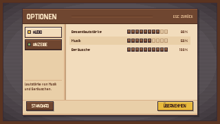
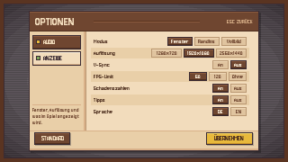

# Optionen-Bildschirm — Pixel-UI

Geht aus dem Pausenmenü (Run **und** Hub) und aus dem Hauptmenü auf. **Dieselbe
Tafel wie das Pausenmenü**, nur anders gefüllt: links eine schmale
Reiterleiste, rechts die Einstellungsliste, unten eine Fußleiste. Das Board hat
eine feste Höhe — bei Reiterwechsel springt nichts, nur der Listeninhalt
wechselt.

Native Auflösung **320x180**, im Spiel 4x hochskaliert. Alle Maße sind echte
Pixel auf 320x180-Basis, Ursprung **oben links**.

**In den Sprites steht kein einziger Buchstabe.** Alle Beschriftungen kommen in
Unity als TextMeshPro darüber; die Zonen stehen unten und als Slices `txt_*`
in der `.aseprite`.





---

## 1. Dateien

```
Assets/Art/UI_Objects/OptionsMenu/
  options_menu.aseprite            Quelldatei: 9 Layer, 2 Frames, 38 Slices
  options_menu.gpl                 Palette (21 Farben, exakt wie vorgegeben)
  preview_audio.png                Mockup Reiter AUDIO, ohne Text
  preview_display.png              Mockup Reiter ANZEIGE, ohne Text
  preview_*_filled.png             dieselben mit Unity-Text (Referenz)
  OPTIONS_UI.md                    diese Datei
  atlas/options_menu_atlas.png     256x256 Sprite-Sheet
  atlas/options_menu_atlas.json    JSON Hash inkl. 9-Slice-Centern

Assets/Resources/OptionsMenu/ui/   17 Einzel-PNGs, transparent, 1:1, je mit .meta

Assets/Scripts/UI/Options/
  OptionsPanel.cs                  das Fenster, baut sich per Code auf
  GameSettings.cs                  die Werte (PlayerPrefs), an einer Stelle
```

Neu gebaut mit `tools/artsource/options_menu.lua` (Aseprite `-b -script`).

### Geteilt mit dem Pausenmenü

Diese Sprites werden **nicht** noch einmal gemalt, sondern aus
`Assets/Resources/PauseMenu/ui/` mitbenutzt — es ist dieselbe Tafel, und zwei
Kopien derselben Pixel würden nur auseinanderlaufen:

`overlay_dim`, `overlay_scanlines`, `overlay_vignette`, `overlay_frame`,
`board_panel`, `header_bar`, `btn_normal`, `btn_active`

Maße und 9-Slice-Ränder dazu stehen in `../PauseMenu/PAUSE_MENU_UI.md`.

### Eigene Sprites

| Sprite | Größe | 9-Slice (l, u, r, o) | wofür |
|---|---|---|---|
| `rail_panel` | 62x110 | 1, 1, 2, 1 | Reiterleiste, 2px Innenschatten rechts |
| `divider_v` | 1x110 | — | #b99772 zwischen Leiste und Liste |
| `divider_h` | 54x1 | — | #d9b189 über der Reiter-Beschreibung |
| `row_zebra` | 176x12 | — | Hintergrund jeder zweiten Zeile |
| `tab_active` | 54x16 | 1, 2, 1, 2 | Pergament, Highlight oben, Schatten unten |
| `tab_inactive` | 54x16 | 1, 2, 1, 2 | Holz |
| `dot_audio` | 5x5 | — | 3x3 #e8b93c + 1px Kontur |
| `dot_display` | 5x5 | — | 3x3 #7fa65a + 1px Kontur |
| `bar_cell_full` | 5x6 | — | gefüllte Lautstärkezelle |
| `bar_cell_empty` | 5x6 | — | leere Lautstärkezelle |
| `chip_on` | 12x10 | 1, 2, 1, 2 | Auswahl-Chip aktiv, Breite über 9-Slice |
| `chip_off` | 12x10 | 1, 1, 1, 2 | Auswahl-Chip inaktiv |
| `scroll_track` | 2x8 | — | Schiene, wird gedehnt |
| `scroll_handle` | 2x8 | — | Griff, wird gedehnt |
| `footer_bar` | 254x20 | 1, 1, 1, 1 | Fußleiste, 1px Trennlinie oben |
| `btn_primary` | 53x15 | 1, 3, 2, 2 | ÜBERNEHMEN 52x14 + 1px Schlagschatten |
| `btn_primary_active` | 53x15 | 2, 2, 1, 3 | derselbe, 1px versetzt (Hover) |

9-Slice in Unity-Reihenfolge: **links, unten, rechts, oben** — so wie es in der
`.meta` unter `spriteBorder: {x, y, z, w}` steht.

---

## 2. Aufbau

Tafel **256x156** bei **(32, 12)** — identisch zum Pausenmenü (das Sprite ist
258x158, die zwei Extrapixel sind der Schlagschatten).

```
 y= 12  Kontur
 y= 13  Kopfleiste, 22 hoch      (header_bar, 254x22)
 y= 35  Rumpf, 110 hoch          (Reiterleiste | Trennlinie | Liste)
 y=145  Fußleiste, 20 hoch       (footer_bar, 254x20)
 y=165  Schatten 2px, dann Kontur
```

Der Rumpf teilt sich waagerecht in

```
 x= 33.. 94   Reiterleiste (62 breit)
 x= 95        Trennlinie #b99772
 x= 96..286   Liste (191 breit)
```

### Kopfleiste

| Element | x | y | b | h |
|---|---|---|---|---|
| `header_bar` | 33 | 13 | 254 | 22 |
| Trennlinie #5a3421 | 104 | 23 | 118 | 1 |
| Highlight #8a5a3d | 104 | 24 | 118 | 1 |

### Reiterleiste

| Element | x | y | b | h |
|---|---|---|---|---|
| `rail_panel` | 33 | 35 | 62 | 110 |
| `divider_v` | 95 | 35 | 1 | 110 |
| Reiter AUDIO | 36 | 39 | 54 | 16 |
| Reiter ANZEIGE | 36 | 57 | 54 | 16 |
| Farbpunkt | Reiter-x + 4 | Reiter-y + 5 | 5 | 5 |
| `divider_h` | 36 | 116 | 54 | 1 |

### Liste

| Element | x | y | b | h |
|---|---|---|---|---|
| Sichtfenster (Maske) | 101 | 40 | 176 | 100 |
| Zeile *i* | 101 | 40 + i·13 | 176 | 12 |
| `scroll_track` / `_handle` | 280 | 40 | 2 | 100 |

Zeileninneres, relativ zur Zeile:

| Element | dx | dy | b | h |
|---|---|---|---|---|
| Lautstärkezelle *c* | 84 + c·6 | 3 | 5 | 6 |
| Chip-Gruppe (rechtsbündig) | endet bei 173 | 1 | variabel | 10 |

Sieben Zeilen (ANZEIGE) ergeben 90px und passen damit ohne Scrollen ins
100px-Fenster. Läuft es später über, scrollt **nur** das Sichtfenster
(`RectMask2D` + Mausrad), die Tafel bleibt gleich groß, und Schiene und Griff
werden eingeblendet.

Chipbreite: alle Chips einer Zeile sind gleich breit — *längste Beschriftung +
8px Innenabstand*, mindestens 18. Die Gruppe steht rechtsbündig in einer Zeile,
kein Umbruch. Bei drei Chips à 34 (`2560x1440`) bleiben von den 123px
verfügbarer Breite noch 17 übrig.

### Fußleiste

| Element | x | y | b | h |
|---|---|---|---|---|
| `footer_bar` | 33 | 145 | 254 | 20 |
| STANDARD (`btn_normal`, sliced) | 38 | 147 | 41 | 15 |
| ÜBERNEHMEN (`btn_primary`) | 229 | 147 | 53 | 15 |

---

## 3. Textzonen

| Zone | x | y | b | h | Größe | Ausrichtung | Farbe |
|---|---|---|---|---|---|---|---|
| Titel „OPTIONEN“ | 39 | 17 | 60 | 14 | 14 | links | #f2dcbc |
| „ESC ZURÜCK“ | 227 | 18 | 54 | 12 | 7 | rechts | #d9b189 |
| Reiterbeschriftung | Reiter-x + 12 | Reiter-y + 3 | 38 | 10 | 8 | links | aktiv #3b2b33, sonst #f2dcbc |
| Reiter-Beschreibung | 36 | 119 | 54 | 23 | 6 | oben links, Umbruch | #6f4630 |
| Zeilenname | Zeile + 3 | Zeile + 1 | 50 | 10 | 7 | links | #4d2e1e |
| Wert (nur Lautstärke) | Zeile + 148 | Zeile + 1 | 25 | 10 | 7 | rechts | #6f4630 |
| Chip-Beschriftung | Chip füllend | | Chipbreite | 10 | 7 | zentriert | aktiv #fff4e0, sonst #6f4630 |
| STANDARD | 41 | 149 | 34 | 10 | 8 | zentriert | #f2dcbc |
| ÜBERNEHMEN | 232 | 149 | 46 | 10 | 8 | zentriert | #4d2e1e |

Schrift überall **Jersey10** — ThaleahFat kann keine Umlaute.

---

## 4. Inhalte und woran sie hängen

Nichts davon hält dieses Fenster selbst. Ton läuft über den vorhandenen
`AudioSettingsManager` (eigene JSON-Datei), die Sprache über `Loc`, alles
andere über `GameSettings` (PlayerPrefs).

### AUDIO — 3 Zeilen, alle Balken

| Zeile | Quelle | Standard |
|---|---|---|
| Gesamtlautstärke | `AudioSettingsManager.SetMasterVolume` | 100 % |
| Musik | `AudioSettingsManager.SetMusicVolume` | 100 % |
| Geräusche | `AudioSettingsManager.SetEffectsVolume` | 100 % |

### ANZEIGE — 7 Zeilen, alle Chip-Gruppen

| Zeile | Werte | Quelle | Standard |
|---|---|---|---|
| Modus | Fenster / Randlos / Vollbild | `GameSettings.Mode` → `Screen.SetResolution` | Randlos |
| Auflösung | 1280x720 / 1920x1080 / 2560x1440 | `GameSettings.ResolutionIndex` | 1920x1080 |
| V-Sync | An / Aus | `QualitySettings.vSyncCount` | Aus |
| FPS-Limit | 60 / 120 / Ohne | `Application.targetFrameRate` | 60 |
| Schadenszahlen | An / Aus | `DamageNumberController.CreateNumber(Crit)` | An |
| Tipps | An / Aus | `[E]`-Hinweis im Hub, Hinweiszeile im Pausenmenü | An |
| Sprache | DE / EN | `Loc.SetLanguage` | Systemsprache |

Der alte Schlüssel `opt_fullscreen` (1 = Vollbild) wird beim ersten Lesen nach
`opt_mode` überführt — wer schon einmal etwas eingestellt hatte, verliert es
nicht.

VSync und FPS-Limit schließen sich aus: mit VSync hängt die Bildrate am
Monitor, dann setzt `GameSettings` `targetFrameRate = -1`.

---

## 5. Bedienung

| Eingabe | Wirkung |
|---|---|
| ESC | zurück (ins Pausenmenü bzw. Hauptmenü) |
| ÜBERNEHMEN | dasselbe — Werte greifen ohnehin sofort |
| STANDARD | alles auf die Werkseinstellungen, inklusive Ton und Sprache |
| Tab | Reiter wechseln |
| Mausrad | Liste scrollen, sobald sie überläuft |
| Klick | Chip wählen, Balkenzelle setzen, Reiter wechseln |

Die Werte greifen **sofort** beim Klick — so war es im bisherigen
Optionen-Fenster auch, und bei Lautstärke und Auflösung ist das die einzige
Art, das Ergebnis zu beurteilen. „ÜBERNEHMEN“ ist deshalb der Schließen-Knopf
und nicht der Speichern-Knopf.

---

## 6. Abweichungen von der Design-Vorgabe

* **Tafel 256x156 statt 256x148, bei y=12 statt y=16.** Die Vorgabe sagt
  „gleiche Maße wie das Pausenmenü“ — und das ist dort auf 156 gewachsen,
  damit die Stats-Spalte hineinpasst. Hier gewinnt die Gleichheit.
* **Zeilen 176x12 statt 118x12.** Bei 191px Listenbreite hätte eine 118er
  Zeile 60px Leerraum gelassen. Höhe und Abstand bleiben wie vorgegeben.
* **`btn_primary_active` kam dazu**, damit ÜBERNEHMEN dasselbe Hover-Verhalten
  hat wie die Holz-Knöpfe.
* Der inaktive Reiter hat zusätzlich die **1px-Kontur #3b2b33** des aktiven —
  ohne sie schwimmt das Holz auf dem Pergament.
