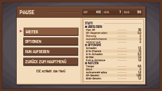
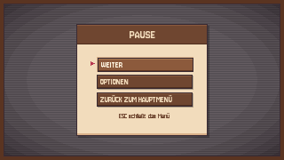
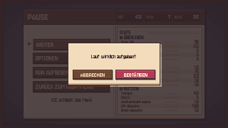

# Pausenmenü — Pixel-UI

Das Fenster, das im laufenden Run und im Hub mit **ESC** aufgeht. Eine
zusammenhängende Pergamenttafel über dem abgedunkelten Spielbild — kein zweites
frei schwebendes Fenster daneben.

Native Auflösung **320x180**, im Spiel 4x hochskaliert. Alle Maße in dieser
Datei sind echte Pixel auf 320x180-Basis, Ursprung **oben links**.

**In den Sprites steht kein einziger Buchstabe.** Alle Beschriftungen, Zahlen
und Werte kommen in Unity als TextMeshPro darüber. Die dafür frei gelassenen
Flächen stehen unten in den Textzonen-Tabellen und in der `.aseprite` als
Slices `txt_*`.







---

## 1. Dateien

```
Assets/Art/UI_Objects/PauseMenu/
  pause_menu.aseprite             Quelldatei: 10 Layer, 3 Frames,
                                  74 Slices (20 Elemente + 54 Textzonen)
  pause_menu.gpl                  Palette (17 Kern- + 4 Sekundärfarben)
  preview_game.png                Mockup Run, ohne Text
  preview_hub.png                 Mockup Hub, ohne Text
  preview_dialog.png              Mockup Bestätigungsdialog, ohne Text
  preview_*_filled.png            dieselben Mockups mit Unity-Text (Referenz)
  PAUSE_MENU_UI.md                diese Datei
  atlas/pause_menu_atlas.png      512x512 Sprite-Sheet
  atlas/pause_menu_atlas.json     JSON Hash inkl. 9-Slice-Centern

Assets/Resources/PauseMenu/ui/    20 Einzel-PNGs, transparent, 1:1, je mit .meta

Assets/Scripts/UI/Pause/
  PauseMenuPanel.cs               das Fenster, baut sich per Code auf
```

> Die Runtime-Sprites liegen unter **Resources**, weil sich das Fenster wie
> `WorkbenchPanel` und `AchievementsBookPanel` komplett per Code aufbaut und
> deshalb nichts über den Inspector verdrahtet bekommt.

Neu gebaut wird alles mit

```
tools/artsource/pause_menu.lua      (Aseprite -b -script)
```

Das Skript schreibt die Einzel-PNGs, die `.aseprite` und die drei Mockups.
Atlas, Palette und die `.meta`-Dateien entstehen im Nachlauf aus derselben
Elementliste.

### Sprite-Liste

| Sprite | Größe | 9-Slice (l, u, r, o) | wofür |
|---|---|---|---|
| `overlay_dim` | 8x8 | — | Abdunklung #2b2028 @ 72 %, wird gedehnt |
| `overlay_scanlines` | 64x64 | — | 1px an / 1px aus, #00000033, wird **gekachelt** |
| `overlay_vignette` | 320x180 | — | zu den Rändern nach #1c1419, gedehnt |
| `overlay_frame` | 12x12 | 5, 5, 5, 5 | innen umlaufend 4px #5a3421 + 1px #3b2b33 |
| `board_panel` | 258x158 | 2, 5, 3, 2 | Tafel 256x156 + 2px Schlagschatten |
| `header_bar` | 254x22 | 1, 1, 1, 1 | Kopfleiste, im Hub auf 146 gestaucht |
| `header_chip` | 38x12 | 1, 1, 1, 2 | Wert-Chip (ZEIT / LEVEL / GOLD) |
| `divider_v` | 2x130 | — | 1px #d9b189 + 1px #fff4e0 |
| `column_right` | 126x130 | 2, 1, 1, 1 | rechte Spalte #e9cfa8, 2px Innenschatten links |
| `stats_panel` | 120x124 | 1, 1, 1, 2 | eingesetzte Stats-Tafel |
| `stats_row_zebra` | 112x6 | — | Hintergrund jeder zweiten Wertzeile |
| `group_dot_red` | 4x4 | — | ÜBERLEBEN |
| `group_dot_yellow` | 4x4 | — | OFFENSIVE |
| `group_dot_green` | 4x4 | — | NUTZEN |
| `btn_normal` | 109x17 | 1, 3, 2, 2 | Knopf 108x16 + 1px Schlagschatten |
| `btn_active` | 109x17 | 2, 2, 1, 3 | derselbe Knopf, 1px versetzt, Pergamentkante |
| `arrow_select` | 5x5 | — | Auswahlpfeil #b83a52 |
| `dialog_panel` | 132x62 | 2, 5, 3, 2 | Dialog 130x60 + 2px Schlagschatten |
| `btn_danger` | 57x15 | 1, 3, 2, 2 | Bestätigen 56x14 + 1px Schlagschatten |
| `btn_danger_active` | 57x15 | 2, 2, 1, 3 | derselbe, 1px versetzt |

9-Slice steht hier in Unity-Reihenfolge: **links, unten, rechts, oben** — genau
so, wie es in der `.meta` unter `spriteBorder: {x, y, z, w}` landet. Die
`.aseprite`-Slices tragen dieselben Ränder als `center`.

---

## 2. Hintergrund

Vier eigene Lagen, damit sich jede in Unity einzeln abschalten lässt:

| Lage | Typ in Unity | Bemerkung |
|---|---|---|
| `overlay_dim` | Simple, gedehnt | fängt auch die Klicks ab, die neben die Tafel gehen |
| `overlay_scanlines` | **Tiled** | gedehnt wären die Streifen je nach Seitenverhältnis 1,3px breit und würden flimmern |
| `overlay_vignette` | Simple, gedehnt | in 7 Stufen gebändert statt weich verlaufen |
| `overlay_frame` | **Sliced** | so bleibt der 4px-Rahmen am Bildschirmrand immer 4px stark |

---

## 3. Tafel im Run

Tafel **256x156** bei **(32, 12)** — mittig, oben und unten je 12px Luft. Das
Sprite ist 258x158, die zwei Extrapixel sind der Schlagschatten rechts unten.

```
 y=  0  Kontur #3b2b33
 y=  1  Kopfleiste, 22 hoch            (header_bar bei 33,13, 254x22)
 y= 23  Rumpf, 130 hoch
 y=153  Schatten 2px #d9b189
 y=155  Kontur #3b2b33
```

Der Rumpf teilt sich waagerecht in

```
 x=  1..126   Menüspalte  (126 breit)
 x=127..128   Trennlinie  (divider_v)
 x=129..254   rechte Spalte (126 breit)
```

### Kopfleiste

| Element | x | y | b | h |
|---|---|---|---|---|
| `header_bar` | 33 | 13 | 254 | 22 |
| Trennlinie #5a3421 | 98 | 23 | 60 | 1 |
| Highlight #8a5a3d | 98 | 24 | 60 | 1 |
| `header_chip` ZEIT | 163 | 18 | 38 | 12 |
| `header_chip` LEVEL | 203 | 18 | 38 | 12 |
| `header_chip` GOLD | 243 | 18 | 38 | 12 |

### Menüspalte

Vier Knöpfe 108x16, Abstand 4, davor der 5x5-Auswahlpfeil. Der Block sitzt
senkrecht mittig im Rumpf.

| Element | x | y | b | h |
|---|---|---|---|---|
| Knopf 1 (WEITER) | 46 | 54 | 109 | 17 |
| Knopf 2 (OPTIONEN) | 46 | 74 | 109 | 17 |
| Knopf 3 (RUN AUFGEBEN) | 46 | 94 | 109 | 17 |
| Knopf 4 (ZURÜCK ZUM HAUPTMENÜ) | 46 | 114 | 109 | 17 |
| `arrow_select` | 39 | Knopf-y + 5 | 5 | 5 |

Im aktiven Zustand rücken Knopf-Sprite (`btn_active`), Beschriftung und Pfeil
gemeinsam um 1px nach rechts unten.

### Rechte Spalte

| Element | x | y | b | h |
|---|---|---|---|---|
| `divider_v` | 159 | 35 | 2 | 130 |
| `column_right` | 161 | 35 | 126 | 130 |
| `stats_panel` | 164 | 38 | 120 | 124 |
| Innenfläche | 168 | 42 | 112 | 116 |
| Linie neben „STATS“ | 206 | 46 | 74 | 1 |

Innen: Kopfzeile 8 hoch, danach drei Gruppen à 36 (Gruppenkopf 6 + fünf
Wertzeilen à 6). Gruppe *g* beginnt bei `y = 50 + g * 36`.

| Element je Gruppe | x | y | b | h |
|---|---|---|---|---|
| `group_dot_*` | 168 | Gruppen-y + 1 | 4 | 4 |
| `stats_row_zebra` (Zeile 2 und 4) | 168 | Zeilen-y | 112 | 6 |
| Führungslinie #d9b189 | 232 | Zeilen-y + 3 | 18 | 1 |

Zeile *r* einer Gruppe: `y = Gruppen-y + 6 + r * 6`.

---

## 4. Tafel im Hub

Gleiche Sprites, nur kleiner geschnitten: **keine** Wert-Chips, **keine**
Stats-Spalte, drei Einträge, Titel mittig.

Tafel **148x126** bei **(86, 27)** — waagerecht und senkrecht mittig. Sowohl
`board_panel` als auch `header_bar` laufen hier als **Sliced**.

| Element | x | y | b | h |
|---|---|---|---|---|
| `board_panel` (sliced) | 86 | 27 | 150 | 128 |
| `header_bar` (sliced) | 87 | 28 | 146 | 22 |
| Knopf 1 (WEITER) | 109 | 64 | 109 | 17 |
| Knopf 2 (OPTIONEN) | 109 | 84 | 109 | 17 |
| Knopf 3 (ZURÜCK ZUM HAUPTMENÜ) | 109 | 104 | 109 | 17 |
| `arrow_select` | 102 | Knopf-y + 5 | 5 | 5 |

---

## 5. Bestätigungsdialog

Geht über „RUN AUFGEBEN“ und „ZURÜCK ZUM HAUPTMENÜ“ auf. Darunter liegt eine
vollflächige Abdunklung #2b2028 @ 80 %, die zugleich jeden Klick daneben
abfängt.

| Element | x | y | b | h |
|---|---|---|---|---|
| `dialog_panel` | 95 | 60 | 132 | 62 |
| Knopf ABBRECHEN (`btn_normal`, sliced) | 102 | 98 | 57 | 15 |
| Knopf BESTÄTIGEN (`btn_danger`) | 162 | 98 | 57 | 15 |

---

## 6. Textzonen

Alle Zonen sind in der `.aseprite` als Slice `txt_*` markiert. Die Höhe ist
bewusst größer als die Schriftgröße: ist das Rechteck zu flach, wirft
TextMeshPro die Zeile still weg.

### Run

| Zone | x | y | b | h | Größe | Ausrichtung | Farbe |
|---|---|---|---|---|---|---|---|
| Titel „PAUSE“ | 39 | 17 | 54 | 14 | 14 | links | #f2dcbc |
| Chip-Label | Chip-x + 2 | 19 | 14 | 10 | 6 | links | #d9b189 |
| Chip-Wert | Chip-x + 17 | 19 | 19 | 10 | 8 | rechts | #fff4e0 |
| Knopfbeschriftung | Knopf-x + 4 | Knopf-y + 3 | 100 | 10 | 10 | links | #f2dcbc / aktiv #fff4e0 |
| Hinweis unter den Knöpfen | 46 | 136 | 108 | 10 | 6 | zentriert | #6f4630 |
| „STATS“ | 168 | 42 | 34 | 8 | 8 | links | #3b2b33 |
| Gruppenname | 174 | Gruppen-y − 2 | 106 | 10 | 8 | links | #3b2b33 |
| Statname | 170 | Zeilen-y − 2 | 60 | 10 | 7 | links | #4d2e1e |
| Statwert | 251 | Zeilen-y − 2 | 28 | 10 | 8 | rechts | #4d2e1e |

Nullwerte werden gedimmt dargestellt — **#6f4630 statt #4d2e1e**, also dunkler
und nicht heller; Name und Wert wechseln gemeinsam.

### Hub

| Zone | x | y | b | h | Größe | Ausrichtung |
|---|---|---|---|---|---|---|
| Titel „PAUSE“ | 87 | 32 | 146 | 14 | 14 | zentriert |
| Knopfbeschriftung | Knopf-x + 4 | Knopf-y + 3 | 100 | 10 | 10 | links |
| Hinweis | 109 | 126 | 108 | 10 | 6 | zentriert |

### Dialog

| Zone | x | y | b | h | Größe | Ausrichtung |
|---|---|---|---|---|---|---|
| Frage | 103 | 68 | 114 | 24 | 8 | zentriert, Umbruch an |
| ABBRECHEN | 105 | 100 | 50 | 10 | 8 | zentriert |
| BESTÄTIGEN | 165 | 100 | 50 | 10 | 8 | zentriert |

Schrift ist überall **Jersey10** — die andere Pixelfont des Projekts
(ThaleahFat) kann keine Umlaute, und hier steht deutscher Text.

---

## 7. Werte

Nichts davon ist im Fenster hinterlegt; alles kommt live aus dem laufenden
Spiel. Die Zuordnung ist dieselbe, die vorher `UIPausPanleStats` über
Listenindizes gemacht hat.

| Zeile | Quelle | Format |
|---|---|---|
| ZEIT | `GameManager.gameTime` | `m:ss` |
| LEVEL | `PlayerController.currentLevel` | ganzzahlig |
| GOLD | `GameManager.EstimateCurrency()` | ganzzahlig |
| Max HP | `playerMaxHealth` | F0 |
| HP-Regeneration | `playerHealthReg` | F1 |
| Rüstung | `playerArmor` | F0 |
| Ausweichchance | `dodgeChance * 100` | F0 |
| Lebensraub | `lifeStealChance` | F0 |
| Schaden | `damageMultiplier` | F1 |
| Krit-Chance | `critChance * 100` | F0 |
| Krit-Schaden | `critDamage` | F1 |
| Größe | `AOERange` | F1 |
| Extra-Schüsse | `playerShots` | F1 |
| Tempo | `moveSpeed` | F1 |
| Glück | `luck` | F0 |
| Aufsammelradius | `pickupRange` | F1 |
| XP-Gewinn | `experienceMultiplier` | F2 |
| Gold-Gewinn | `GameManager.currencyGainMultiplire` | F1 |

`EstimateCurrency()` ist die Formel, mit der `GameManager.GameOver()`
abrechnet — jetzt als eigene Methode, damit der Chip nicht auseinanderläuft
mit dem, was am Ende gutgeschrieben wird.

---

## 8. Bedienung

| Taste | Wirkung |
|---|---|
| ESC | öffnet und schließt das Menü; im Dialog nur den Dialog |
| ↑ ↓ / W S | Auswahl bewegen |
| Enter / Leertaste | bestätigen |
| ← → / A D | im Dialog zwischen ABBRECHEN und BESTÄTIGEN |
| Maus | Hover setzt die Auswahl, Klick löst aus |

„OPTIONEN“ öffnet den `OptionsPanel` (Sortierung 210, also über dem
Pausenmenü mit 200) — siehe `../OptionsMenu/OPTIONS_UI.md`. „RUN AUFGEBEN“ und
„ZURÜCK ZUM HAUPTMENÜ“ fragen erst nach; „ZURÜCK ZUM HAUPTMENÜ“ lädt das
Hauptmenü hart mit `LoadSceneMode.Single` und räumt damit Level, Map-Szene und
Hub in einem Rutsch ab.

Die Hinweiszeile unter den Knöpfen hängt an der Option **Tipps** — ist sie aus,
wird sie gar nicht erst angelegt.

Im Run steht `Time.timeScale` auf 0, solange das Menü offen ist. Im Hub läuft
die Zeit weiter; gesperrt wird dort wie bei Shop und Skilltree über
`HubUI.PushModal()` und `SetPlayerFrozen(true)`.

---

## 9. Abweichungen von der Design-Vorgabe

Drei Maße mussten sich bewegen, sonst wäre der Entwurf nicht aufgegangen:

* **Tafel 256x156 statt 256x148.** Fünfzehn Statzeilen, drei Gruppenköpfe und
  eine Kopfzeile passen in 148 nicht neben eine 22px-Kopfleiste. 156 ist der
  kleinste Wert, bei dem es glatt aufgeht, und lässt oben wie unten noch 12px
  Luft.
* **Wertzeile 112x6 statt 112x7.** Dasselbe Platzproblem — bei 7 fehlen 15px.
  Mit Jersey10 in Größe 7 bleibt die Zeile gut lesbar.
* **Wert-Chip 38x12 statt 34x12.** Bei 34 stößt „12:34“ an sein Label.

Dazu zwei Sprites mehr als in der Liste: `overlay_frame` (der in der Vorgabe
beschriebene umlaufende Rahmen, der sonst keinen eigenen Namen hatte) und
`column_right` (die Fläche der rechten Spalte, ebenfalls beschrieben, aber
nicht gelistet). `btn_danger_active` kam dazu, damit der Bestätigen-Knopf ein
Hover hat.

Vier Farben der Vorgabe stehen nicht in der Kernpalette und sind in der `.gpl`
als Sekundärtöne geführt: #8a5a3d, #a87a52, #7a4f37, #d4566c.
