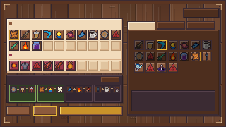
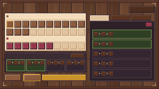

# Werkbank / Verteiler-Bildschirm — Pixel-UI

Der Bildschirm, an dem der Spieler vor dem Lauf seinen **Verteiler** zusammen-
stellt: den Topf, aus dem beim Level-Up gezogen wird. Die Sachen sind hier
**nicht ausgerüstet** — sie sind nur der Vorrat. Geht auf, wenn der Spieler an
der Werkbank im Hub **E** drückt.

Native Auflösung **320x180**, im Spiel 4x hochskaliert. Alle Maße in dieser
Datei sind echte Pixel auf 320x180-Basis, Ursprung **oben links**.

**In den Sprites steht kein einziger Buchstabe.** Alle Beschriftungen, Zähler
und Namen kommen in Unity als TextMeshPro darüber. Die dafür frei gelassenen
Flächen stehen unten in der Textzonen-Tabelle.





---

## 1. Dateien

```
Assets/Art/UI_Objects/Workbench/
  workbench.aseprite              Quelldatei: 9 Layer, 2 Frames,
                                  49 Slices (27 Elemente + 22 Textzonen)
  workbench.gpl                   Palette (17 Kern- + 8 Sekundärfarben)
  preview_page_1.png              Mockup Grundzustand
  preview_page_2.png              Mockup mit offener Evo-Übersicht
  preview_filled.png              Mockup mit echten Icons (Referenz)
  WORKBENCH_UI.md                 diese Datei
  atlas/workbench_atlas.png       512x512 Sprite-Sheet
  atlas/workbench_atlas.json      JSON Hash inkl. 9-Slice-Centern

Assets/Resources/Workbench/
  ui/                             30 Einzel-PNGs, transparent, 1:1, je mit .meta
  <weaponID>_14.png               45 Icons für die 14x14-Kachel
  <weaponID>_10.png               45 Icons für den 10x10-Slot

Assets/Scripts/Workbench/
  WeaponCatalog.cs                Waffen, Buffs, Evos, Rezepte
  WorkbenchIcons.cs               findet <id>_14 / <id>_10
  Loadout.cs                      der Verteiler und seine Regeln
  LoadoutStore.cs                 loadout.json, ein Verteiler je Charakter
  WorkbenchTrigger.cs             [E] an der Werkbank
  UI/WorkbenchPanel.cs            das Fenster, baut sich per Code auf
  Editor/WorkbenchTools.cs        Menü: Katalog und Icons prüfen

Assets/Tests/EditMode/
  WorkbenchTests.cs               Katalog gegen Prefab, Verteiler-Regeln
```

> Die Runtime-Sprites liegen unter **Resources**, weil sich das Fenster wie
> `AchievementsBookPanel` komplett per Code aufbaut und deshalb nichts über den
> Inspector verdrahtet bekommt. Die .aseprite-Quelle, die Vorschauen und der
> Atlas bleiben im Art-Ordner.

### Sprite-Liste

| Sprite | Größe | 9-Slice (l,u,r,o) |
|---|---|---|
| `bg_workbench` | 320x180 | 6, 6, 6, 6 |
| `panel_parchment` | 167x80 | 3, 5, 5, 3 |
| `panel_dark` | 167x42 | 2, 4, 4, 2 |
| `panel_library` | 133x124 | 3, 5, 5, 3 |
| `overlay_evo` | 131x122 | 2, 2, 2, 2 |
| `info_box` | 119x30 | 2, 2, 2, 2 |
| `tab_active` | 40x12 | 3, 1, 3, 3 |
| `tab_inactive` | 40x12 | 3, 3, 3, 3 |
| `slot_empty` | 14x14 | 2, 2, 2, 2 |
| `slot_weapon` | 14x14 | 2, 2, 2, 2 |
| `slot_buff` | 14x14 | 2, 2, 2, 2 |
| `slot_used` | 14x14 | 2, 2, 2, 2 |
| `slot_locked` | 14x14 | 2, 2, 2, 2 |
| `slot_highlight` | 14x14 | 1, 1, 1, 1 |
| `hover_frame` | 6x6 | 2, 2, 2, 2 |
| `slot_evo` | 10x10 | 2, 2, 2, 2 |
| `slot_evo_highlight` | 10x10 | 1, 1, 1, 1 |
| `evo_chip_ok` | 38x24 | 2, 2, 2, 2 |
| `evo_chip_pending` | 38x24 | 2, 2, 2, 2 |
| `evo_row_ok` | 119x18 | 2, 2, 2, 2 |
| `evo_row_pending` | 119x18 | 2, 2, 2, 2 |
| `btn_wide` | 90x14 | 3, 3, 3, 3 |
| `btn_narrow` | 34x14 | 3, 3, 3, 3 |
| `btn_small` | 28x10 | 3, 3, 3, 3 |
| `btn_primary` | 90x14 | 3, 3, 3, 3 |
| `btn_primary_disabled` | 90x14 | 3, 3, 3, 3 |
| `btn_close` | 14x10 | 3, 3, 3, 3 |
| `btn_back` | 52x14 | 3, 3, 3, 3 |
| `sign_plus` | 3x3 | — |
| `sign_equals` | 3x3 | — |

> **Alle UI-Sprites stehen auf PPU 100.** Unity rechnet 9-Slice-Ränder gegen
> die Referenz 100; bei PPU 32 wäre der 1px-Rahmen dreimal so dick und würde
> kleine Kacheln komplett zudecken.

> `panel_parchment`, `panel_dark` und `panel_library` sind **2px größer als
> ihre Fläche** — der Schlagschatten nach rechts/unten steckt mit im Sprite.
> Deshalb 167x80 statt 165x78 und so weiter.

> `hover_frame` ist der Maus-Rahmen für **alle** Knöpfe und Reiter. Ein
> einziges 6x6-Sprite reicht, weil es als 9-Slice auf jede Knopfgröße gezogen
> wird — bei PPU 100 bleibt die Kante dabei genau einen Pixel breit.

> `btn_back` ist absichtlich dunkler (`#4d2e1e`) als die Aktionsknöpfe:
> Weggehen ist keine Aktion. Seine rechte Kante liegt bündig mit der
> Bibliothek darunter.

> `btn_wide` und `slot_evo_highlight` sind heute unbenutzt. Sie liegen dabei,
> weil die Knopfzeile und die Evo-Chips damit ohne neue Grafik umgebaut werden
> können.

---

## 2. Palette

Kernpalette, exakt wie vorgegeben:

| Hex | Verwendung |
|---|---|
| `#f2dcbc` | Pergament (Verteiler-Board) |
| `#e0c49f` | aktiver Reiter, leerer Verteiler-Slot |
| `#d9b189` | Trennlinie, Slotschatten, Metall |
| `#b99772` | Slotkontur, "+"- und "="-Zeichen, Messing |
| `#8c5a3c` | Waffenkachel, Knopf, Tischplatte |
| `#6f4630` | Holz hell |
| `#5a3421` | Rahmenleiste, inaktiver Reiter |
| `#4d2e1e` | Bibliothek |
| `#3b2b33` | Kontur, Evo-Leiste |
| `#b83a52` | Rot hell |
| `#96384c` | Buffkachel, Schließen-Knopf |
| `#e8b93c` | Auswahl- und Hover-Rahmen |
| `#c9922a` | Hauptknopf |
| `#f7d76a` | Hauptknopf, Lichtkante |
| `#fff4e0` | Pergament, Lichtkante |
| `#7fa65a` | Evo möglich, Rahmen |
| `#2f3f24` | Evo möglich, Fläche |

Sekundärtöne, die aus dem Aufbau folgen (Lichtkanten, Overlay, Zustände):

| Hex | Verwendung |
|---|---|
| `#55414c` | Lichtkante auf Dunkel, Rahmen "unvollständig" |
| `#2b2028` | Evo-Overlay-Fläche (95% Deckkraft), Kontur auf Dunkel |
| `#42281a` | bereits im Verteiler (`slot_used`) |
| `#7a4f37` | Holz-Lichtkante, inaktiver Reiter |
| `#eed6b4` | leerer Slot, Lichtkante |
| `#f7e8cf` | aktiver Reiter, Lichtkante |
| `#a89070` | Hauptknopf gesperrt |
| `#332630` | Evo unvollständig, Fläche |

Die Kantenlogik der Bibliothekskacheln (`#ffffff33` Licht, `#00000055`
Schatten) ist **ausgerechnet** und nicht als Alphawert im Sprite: das Ergebnis
ist Fläche + 20% Weiß beziehungsweise Fläche + 33% Schwarz. Damit bleibt jede
Kachel bei genau drei Farben plus Kontur.

---

## 3. Seitenaufbau (320x180)

```
 0            9                   174 180                   311  320
 ┌─────────────────────────────────────────────────────────────────┐ 0
 │ Rahmen: 1px #3b2b33, 4px #5a3421, 1px #3b2b33   (5px, Ecken 8x8) │
 │  ┌──────────────────────────────┐                               │ 14  Kopfzeile h=9
 │  │ Titel                                          [ZURÜCK]      │
 │  ├──────────────────────────────┐   ┌────┬────┬────┐            │ 30  Reiter 40x12
 │  │ VERTEILER  (Pergament)       │   │ akt│    │    │            │
 │  │  WAFFEN         n / 18       │   ├────┴────┴────┴──────┐     │ 42  Bibliothek
 │  │  ◆▢▢▢▢▢▢▢▢▢  ◆ = Startwaffe  │   │  Bibliothek         │     │     131x122
 │  │  ▢▢▢▢▢▢▢▢▢▢   2 Reihen       │   │  7 Spalten          │     │
 │  │  BUFFS          n / 10       │   │  ▢▢▢▢▢▢▢            │     │
 │  │  ▢▢▢▢▢▢▢▢▢▢   1 Reihe        │   │  ▢▢▢▢▢▢▢            │     │
 │  └──────────────────────────────┘   │                     │     │ 104
 │  ┌──────────────────────────────┐   │  ┌───────────────┐  │     │ 106 Evo-Leiste
 │  │ EVOS 3/8            [alle]   │   │  │ Info-Box      │  │     │     165x40
 │  │ ▣+▣=▣  ▣+▣=▣  ▣+▣=▣  ▣+▣=▣   │   │  └───────────────┘  │     │
 │  └──────────────────────────────┘   └─────────────────────┘     │ 146 / 164
 │  [LEEREN][FÜLLEN][ BUILD ÜBERNEHMEN ]                           │ 150 Knopfzeile h=14
 └─────────────────────────────────────────────────────────────────┘ 180
```

| Element | x | y | b | h |
|---|---|---|---|---|
| Kopfzeile | 9 | 14 | 140 | 9 |
| Zurück-Knopf | 259 | 12 | 52 | 14 |
| Verteiler-Board | 9 | 26 | 165 | 78 |
| Waffen-Raster (10x2) | 13 | 42 | 158 | 30 |
| Buff-Raster (10x1) | 13 | 86 | 158 | 14 |
| Evo-Leiste | 9 | 106 | 165 | 40 |
| Evo-Chips (4) | 13 | 120 | 38 | 24 |
| Knopfzeile | 9 | 150 | 165 | 14 |
| Reiter (3) | 180 | 30 | 40 | 12 |
| Bibliothek | 180 | 42 | 131 | 122 |
| Bibliotheks-Sichtfenster | 186 | 57 | 119 | 62 |
| Bibliotheks-Raster (7 Spalten) | 190 | 57 | 110 | — |
| Info-Box | 186 | 128 | 119 | 30 |
| Evo-Overlay | 180 | 42 | 131 | 122 |
| Overlay-Zeilen | 186 | 60 | 119 | 18 |

Raster überall: Kachel **14x14**, Schritt **16** (2px Luft). Evo-Slots **10x10**,
Schritt **13** (3px für das Zeichen dazwischen).

Chip-Innenleben (relativ zur Chip-Ecke, Chip ist 38x24):

| Teil | dx | dy | b | h |
|---|---|---|---|---|
| Slot Zutat A | 1 | 2 | 10 | 10 |
| `sign_plus` | 11 | 5 | 3 | 3 |
| Slot Zutat B | 14 | 2 | 10 | 10 |
| `sign_equals` | 24 | 5 | 3 | 3 |
| Slot Ergebnis | 27 | 2 | 10 | 10 |

Overlay-Zeile (relativ zur Zeilenecke, Zeile ist 119x18):

| Teil | dx | dy | b | h |
|---|---|---|---|---|
| Slot Zutat A | 2 | 4 | 10 | 10 |
| `sign_plus` | 13 | 7 | 3 | 3 |
| Slot Zutat B | 17 | 4 | 10 | 10 |
| `sign_equals` | 28 | 7 | 3 | 3 |
| Slot Ergebnis | 32 | 4 | 10 | 10 |

---

## 4. Textzonen

Alle Angaben absolut auf 320x180, sofern nicht anders vermerkt. Die Slices in
der .aseprite-Datei heißen genauso.

| Slice | x | y | b | h | Ausrichtung | Inhalt |
|---|---|---|---|---|---|---|
| `text_title` | 9 | 14 | 140 | 9 | links | `ui.workbench.title` |
| `text_btn_back` | 261 | 14 | 48 | 10 | mittig | `ui.workbench.btn.back` |
| `text_group_weapons` | 20 | 29 | 80 | 9 | links | `ui.workbench.group.weapons` |
| `text_count_weapons` | 110 | 29 | 60 | 9 | rechts | `n / 18` |
| `text_group_buffs` | 20 | 74 | 80 | 9 | links | `ui.workbench.group.buffs` |
| `text_count_buffs` | 110 | 74 | 60 | 9 | rechts | `n / 10` |
| `text_evo_title` | 20 | 108 | 80 | 9 | links | `EVOS n / 8` |
| `text_evo_button` | 144 | 110 | 24 | 7 | mittig | `ui.workbench.evo.all` |
| `text_evo_chip_name` | +2 | +13 | 34 | 9 | mittig | Evo-Name, gekürzt |
| `text_btn_narrow_1` | 11 | 152 | 30 | 10 | mittig | `ui.workbench.btn.clear` |
| `text_btn_narrow_2` | 49 | 152 | 30 | 10 | mittig | `ui.workbench.btn.fill` |
| `text_btn_primary` | 86 | 152 | 86 | 10 | mittig | `ui.workbench.btn.apply` / `.applied` |
| `text_tab_1..3` | 182 / 224 / 266 | 32 | 36 | 9 | mittig | Reiterbeschriftung |
| `text_library_head` | 186 | 46 | 119 | 9 | links | `ui.workbench.library.*` |
| `text_info_name` | 190 | 131 | 111 | 9 | links | Name des Eintrags |
| `text_info_desc` | 190 | 141 | 111 | 16 | oben links | Beschreibung, umbrechend |
| `text_overlay_title` | 186 | 46 | 100 | 9 | links | `ui.workbench.overlay.title` |
| `text_evo_row_name` | +46 | +2 | 58 | 9 | links | Evo-Name |
| `text_evo_row_sub` | +46 | +10 | 58 | 7 | links | `Zutat A + Zutat B` |
| `text_evo_row_state` | +104 | +5 | 13 | 9 | rechts | `2/2`, `1/2`, `0/2` |

Schriftgrößen: **10** für den Titel, **8** für Beschriftungen und Namen, **6**
für Hinweise, Chip-Namen und Zustände.

**Schrift: Jersey10.** Ausgewählt wird sie nicht über den Namen, sondern über
die Fähigkeit — `WorkbenchPanel.FindFont()` nimmt die erste geladene Schrift,
die ein `ü` darstellen kann, und bevorzugt darunter Jersey10. Die Hausschrift
ThaleahFat (TMP-Asset `PixelArtFont`) kennt nur 106 Zeichen und macht aus
„ZUFÄLLIG" ein „ZUF LLIG". Die deutschen Werkbank-Texte in `de.json` sind
deshalb die einzigen in der Datei, die **echte Umlaute** tragen — der Rest
bleibt bei ae/oe/ue, weil dort noch ThaleahFat rendert.

> Die Höhe einer Textzone muss größer sein als die Schriftgröße. Ist das
> Rechteck zu flach, wirft TextMeshPro die Zeile still weg und es steht gar
> nichts da.

---

## 5. Zustände

### Kacheln

| Zustand | Sprite | Fläche |
|---|---|---|
| Verteiler-Slot leer | `slot_empty` | `#e0c49f`, Kontur `#b99772` |
| Verteiler-Slot Waffe | `slot_weapon` | `#8c5a3c` |
| **Erster Platz (Startwaffe)** | `slot_locked` | `#8c5a3c`, Kontur **`#c9922a`** |
| Verteiler-Slot Buff | `slot_buff` | `#96384c` |
| Bibliothek, frei | `slot_weapon` / `slot_buff` | wie oben |
| Bibliothek, schon verteilt | `slot_used` | `#42281a`, Icon auf 45% gedimmt |
| Bibliothek, Startwaffe (nicht wählbar) | `slot_used` | wie „schon verteilt“, steht aber an erster Stelle |
| Evo-Eintrag (nicht wählbar) | `slot_used` | Icon gedimmt |
| Maus darüber | `slot_highlight` darüber | 1px `#e8b93c` |

### Knöpfe und Reiter

Dieselbe Sprache: `hover_frame` legt sich als 1px `#e8b93c` **über** den Knopf,
sein Sprite bleibt unangetastet. Das ist Absicht — welches Sprite ein Knopf
trägt, entscheidet `Refresh()`; ein getauschtes wäre beim nächsten Auffrischen
wieder weg.

Zwei Ausnahmen, beide über `AddHover(target, canHover)`:

| Element | leuchtet nicht, wenn |
|---|---|
| Hauptknopf | der Verteiler nicht voll ist — ein grauer Knopf soll nicht so tun, als ginge etwas |
| Reiter | er schon der aktive ist — das sagt sein Sprite bereits |

Wird der Hauptknopf grau, während die Maus darauf liegt, schaltet
`RefreshApply()` den stehengebliebenen Rahmen ab.

### Evo-Chips und -Zeilen

| Zustand | Sprite | Bedeutung |
|---|---|---|
| beide Zutaten im Verteiler | `evo_chip_ok` / `evo_row_ok` | im Lauf erreichbar |
| eine oder keine | `evo_chip_pending` / `evo_row_pending` | fehlt noch etwas |

In beiden Fällen sind die Icons der **fehlenden** Zutaten gedimmt. Damit sieht
man am Chip, was fehlt, ohne den Namen zu lesen.

### Hauptknopf

| Zustand | Sprite | Beschriftung |
|---|---|---|
| beide Gruppen voll | `btn_primary` | `ui.workbench.btn.apply` |
| voll und übernommen | `btn_primary` | `ui.workbench.btn.applied` |
| unvollständig | `btn_primary_disabled` | dieselbe, nur in `#6f4630` statt `#4d2e1e` |

**Was noch fehlt, steht in der Hinweiszeile oben** (`ui.workbench.hint.missing`),
nicht auf dem Knopf: "Es fehlen noch 5 Waffen und 3 Buffs" braucht bei
Schriftgröße 8 rund 116px, der Knopf hat 86.

---

## 6. Datenanbindung

Es wird **kein zweites Datenmodell** gebaut. Alles hängt an dem, was schon da
ist — am **Player-Prefab**.

| Was | Wo |
|---|---|
| Waffen, Buffs, Evos | `Assets/Prefabs/Player.prefab`, die `Weapon`-Bauteile (`weaponID`, GameObject-Name, `weaponIcon`) |
| Evo-Rezepte | `PlayerController.EvoCombinations` am selben Prefab |
| Abschrift für den Hub | `WeaponCatalog.cs` |
| Zustand des Verteilers | `Loadout` + `loadout.json` (je Charakter einer) |
| Icons | `WorkbenchIcons.Get(id, 14 \| 10)` → `Resources/Workbench/<id>_<n>.png` |
| Wirkung im Lauf | `PlayerController.IsWeaponUnlocked` / `IsBuffUnlocked` fragen `Loadout.AllowsInRun` |
| Startwaffe je Charakter | `Characters.StartWeaponId(skinIndex)` |

### Warum eine Abschrift

Der Hub lädt das Player-Prefab nicht. Ohne `PlayerController` gibt es dort
keine `activeWeapon`-Liste, aus der sich die Werkbank bedienen könnte — also
steht der Katalog als Code da, wie bei `Shop`, `Unlocks` und `Ach` auch.

Abschriften laufen auseinander. Dagegen gibt es zwei Netze:

* **`Tools ▸ Werkbank ▸ Katalog gegen Player-Prefab prüfen`** liest das Prefab
  und meldet jede Abweichung samt der Zeile, die im Katalog fehlt.
* **`Assets/Tests/EditMode/WorkbenchTests.cs`** prüft dasselbe als Test, damit
  es niemand vergessen kann.

Neue Waffe? Zeile in `WeaponCatalog` eintragen, Icons erzeugen, fertig. Beide
Netze sagen genau, was fehlt.

### Der erste Waffenplatz

Platz 0 der Waffen gehört der **Standardwaffe des gewählten Charakters**. Sie
liegt dort immer, lässt sich nicht herausnehmen und zählt mit. Beim braunen
Keks ist das der Shurikookie.

Woher die Zuordnung kommt: `Characters.cs` führt sie zweimal —
`StartWeaponByskin` als Index in `PlayerController.activeWeapon` (das braucht
das Spiel) und `StartWeaponIdByskin` als `weaponID` (das braucht der Hub, der
den Spieler nicht hat). Dass beide dasselbe meinen, prüft
`WorkbenchTests.Startwaffen_stimmen_mit_dem_Player_Prefab_ueberein`.

| Charakter | Skin | Startwaffe |
|---|---|---|
| Brauner Keks | 0 | `shurikookie` |
| Grauer Keks | 1 | `spike_fork` |
| Roter Keks | 2 | `blade_swarm` |
| Marmelade | 3 | `jam_jar` |

**Ein neuer Charakter** braucht in `Characters.cs` einen Eintrag in *beiden*
Listen. Fehlt der zweite, meckert der Test.

### Ein Verteiler je Charakter

Jeder Charakter hat seinen **eigenen** Verteiler — so wie er seinen eigenen
Skilltree hat. Ein Wechsel blättert nur um: der Build des anderen liegt genau
so da, wie man ihn verlassen hat, samt seinem „übernommen“. Es verschiebt sich
nichts, und keine fremde Startwaffe bleibt als normale Waffe liegen.

| Wer | Was |
|---|---|
| `Loadout.CurrentCharacter` | `Shop.RunSkinIndex` — im Hub der gewählte, im Lauf der eingefrorene |
| `Loadout.SyncCharacter()` | stellt um und feuert `Changed`; hängt an `Shop.SkinIndex` und am Öffnen der Werkbank |
| `LoadoutStore.Use(int)` | blättert im Speicher auf den Verteiler dieses Charakters |

Der Abgleich sitzt zusätzlich im `Store`-Zugriff von `Loadout` — ein Wechsel
kann überall passieren (Charakterauswahl, Cheat-Konsole, Testszene), und zwei
`int` zu vergleichen ist billiger, als jede dieser Stellen zu kennen.

Weil `RunSkinIndex` im Lauf eingefroren ist, spielt jeder Lauf mit dem Build,
mit dem er gestartet wurde — auch wenn im Hub danach gewechselt wird.

**Der Spielstand** (`loadout.json`, Version 2) führt eine Liste von Einträgen,
je einer mit `character`, `active`, `weapons`, `buffs`. Ein v1-Stand hatte nur
einen einzigen Verteiler; der geht an den Charakter, der beim ersten Laden
danach fragt — also an den zuletzt gespielten. Die anderen fangen leer an.

### Auswahl-Regeln

* Klick in der Bibliothek legt in den Verteiler, Klick auf einen belegten
  Verteiler-Slot nimmt zurück. Ein zweiter Klick auf dieselbe Bibliothekskachel
  tut dasselbe. Der erste Platz reagiert auf beides nicht.
* **Die Startwaffe steht auch in der Bibliothek ganz vorne** (`LockedFirst`),
  sieht dort aus wie „schon verteilt“ und lässt sich nicht anklicken — sie liegt
  fest im Verteiler, ein Klick hätte nichts zu tun. Den goldenen Rahmen
  (`slot_locked`) trägt nur ihr Platz im Verteiler selbst; in der Bibliothek
  hieße er „wähl mich“.
* Höchstens **20 Waffen** und **10 Buffs** — das sind die Plätze im Raster.
* **Evos lassen sich nicht verteilen.** Sie entstehen im Lauf aus zwei
  ausgereizten Zutaten; der Reiter zeigt sie nur.
* **ZUFÄLLIG** würfelt beide Gruppen komplett neu aus (Fisher-Yates, ohne
  Zurücklegen). Was drin war, fliegt vorher raus — sonst würde der Knopf beim
  zweiten Druck nichts mehr tun. Der erste Platz bleibt.
* **LEEREN** räumt beide Gruppen, bis auf den ersten Platz.
* "Build übernehmen" wird erst aktiv, wenn beide Gruppen voll sind. Voll heißt
  `min(Plätze, was es im Spiel gibt)` — siehe Abschnitt 8.
* Wer nach dem Übernehmen etwas herausnimmt, fällt automatisch zurück auf
  "alles, was freigeschaltet ist". "Übernommen" und "unvollständig" darf es
  nicht gleichzeitig geben.

### Wirkung im Lauf

Solange nie übernommen wurde, sagt `Loadout.AllowsInRun` zu allem ja — ein
alter Spielstand verhält sich exakt wie vorher. Ist der Verteiler aktiv, ist er
ein hartes Sieb vor den bestehenden Freischalt-Regeln:

1. Startwaffe (`Shop.RunStartWeapon`) — **immer** erlaubt, auch wenn sie nicht
   im Verteiler liegt. Ohne Aufstiegsmöglichkeit wäre sie ein toter Slot.
2. Verteiler.
3. Standard-Freischaltungen und Shop, unverändert.

---

## 7. Icons

### Wie die Dateien heißen

Für jede Id gibt es **zwei** PNGs in `Assets/Resources/Workbench/`:

| Datei | Leinwand | Motiv | sitzt in |
|---|---|---|---|
| `<weaponID>_14.png` | 14x14 | 12x12 | Verteiler- und Bibliothekskachel |
| `<weaponID>_10.png` | 10x10 | 8x8 | Evo-Chip und Evo-Zeile |

Beispiel: `Assets/Resources/Workbench/shurikookie_14.png` und
`shurikookie_10.png`.

**Leinwand = Slot-Außenmaß, Motiv = Slot-Öffnung.** Der Rahmen der Kachel
steckt nicht im Icon — er kommt als eigenes Sprite darunter. Das Icon liegt
deckungsgleich darüber, die äußeren 1px bleiben also frei. Transparent, kein
Anti-Aliasing, Alpha hart (entweder 0 oder 255).

Die Kachel darunter ist mal hell (`slot_empty`, Pergament) und mal dunkel
(`slot_weapon`, `slot_used`) — eine **1px-Kontur in `#3b2b33`** um die
Silhouette hält das Motiv auf beiden lesbar.

### Die Liste

### WAFFEN (18)

| Datei (ohne Groesse) | Waffe |
|---|---|
| `blade_swarm` | Klingenschwarm |
| `boba_gun` | Boba-Kanone |
| `boomerang` | Bumerang |
| `butterblast` | Butterblast |
| `candy_bomb` | Bonbonbombe |
| `celestial_star` | Himmelsstern |
| `coffee_pool` | Kaffeepfütze |
| `cookie_saw` | Keksäge |
| `crumb_trail` | Krümelspur  <-- noch Platzhalter |
| `deathstrike` | Todesstoß |
| `fire_ball` | Feuerball |
| `jam_jar` | Marmeladenglas |
| `shurikookie` | Shurikookie |
| `spike_fork` | Stachelgabel |
| `time_laser` | Zeitlaser |
| `turret` | Geschütz  <-- noch Platzhalter |
| `void_spike` | Leerenstachel |
| `vortex` | Strudel  <-- noch Platzhalter |

### BUFFS (19)

| Datei (ohne Groesse) | Waffe |
|---|---|
| `buff_aoe_range` | Wirkbereich |
| `buff_armor` | Rüstung |
| `buff_cooldown` | Abklingzeit  <-- noch Platzhalter |
| `buff_crit_chance` | Krit-Chance |
| `buff_crit_damage` | Krit-Schaden |
| `buff_currency` | Münzen |
| `buff_damage` | Schaden |
| `buff_dodge` | Ausweichen |
| `buff_duration` | Wirkdauer  <-- noch Platzhalter |
| `buff_extra_shot` | Extraschuss |
| `buff_glass_cannon` | Glaskanone  <-- noch Platzhalter |
| `buff_life_steal` | Lebensraub |
| `buff_luck` | Glück |
| `buff_max_hp` | Max. Leben |
| `buff_move_speed` | Tempo |
| `buff_pickup_range` | Sammelweite |
| `buff_regeneration` | Regeneration |
| `buff_second_chance` | Zweite Chance  <-- noch Platzhalter |
| `buff_xp_gain` | Erfahrung |

### EVOS (8)

| Datei (ohne Groesse) | Waffe |
|---|---|
| `evo_blade_storm` | Klingensturm |
| `evo_bloody_fork` | Blutgabel |
| `evo_boba_saw` | Boba-Säge |
| `evo_bomb_swarm` | Bombensäge |
| `evo_boomerang` | Sturmbumerang |
| `evo_explosive_star` | Explosivstern |
| `evo_shuril_blast` | Shuri-Blast |
| `evo_sticky_shatter` | Klebesplitter  <-- noch Platzhalter |

### Woraus die jetzigen entstanden sind

Kein Motiv ist erfunden: Quelle ist jeweils das Icon, das am `Weapon`-Bauteil
im Player-Prefab hängt (`weaponIcon`). Verfahren: Sub-Sprite aus seinem Blatt
schneiden → transparenten Rand abziehen → auf Motivgröße minus 2px
herunterrechnen (Lanczos) → Alpha hart bei 110 schneiden → auf 6 (bzw. 4)
Farben quantisieren → 1px Kontur.

Bewusst **nicht** auf die UI-Palette quantisiert: die Waffen sind bunt, und 17
Braun- und Rottöne würden die Motive einebnen.

Acht Einträge zeigen deshalb noch das rote Platzhalter-Dreieck — dort hängt am
Prefab `Resources/Shop/_missing.png` statt eines eigenen Icons. Sie sind oben
markiert.

`Tools ▸ Werkbank ▸ Icons prüfen` listet, was fehlt.


## 8. Bewusste Abweichungen von der Vorgabe

| Vorgabe | Gebaut | Warum |
|---|---|---|
| "exakt 20 Waffen und 10 Buffs gewählt" | `min(20, 18)` Waffen, `min(10, 19)` Buffs | Es gibt 18 Waffen. Die Forderung "20" wäre unerfüllbar, der Knopf bliebe für immer grau. Die Zahl zieht von selbst nach, sobald Waffen dazukommen. Die 20 Kacheln bleiben stehen. |
| "Evolutions (Waffe + Buff)" | Zutat + Zutat, Art egal | Im Prefab sind 6 von 8 Rezepten Waffe+Waffe, 2 sind Waffe+Buff (`evo_boomerang`, `evo_sticky_shatter`). Die Anzeige unterscheidet darum nicht. |
| 5 Evo-Chips à 30x22 mit drei 11x11-Slots | 4 Chips à 38x24 mit drei 10x10-Slots | Drei 11x11-Slots plus zwei Zeichen brauchen 39px; in 30px passt das nicht. 4x38 + 3x2 = 158 füllt die Spalte exakt. Alle 8 Evos zeigt das Overlay. |
| Overlay-Zeilen mit 11x11-Slots | 10x10 | Sonst bräuchte es eine dritte Icon-Größe für einen Pixel Unterschied. |
| Reiter bei y=26 | y=30 | Bei y=26 blieben 4px Holz zwischen Reiter und Panel — das sieht nicht nach Reitern aus. Jetzt stoßen sie an die Panelkante. |
| "Reiter 40x12, 2px Abstand" | unverändert, ab x=180 | 3x40 + 2x2 = 124 bei 131 Spaltenbreite. Die 7px rechts bleiben frei; eine krumme Reiterbreite wäre auffälliger. |
| Holzebene „24px Bretter, zwei Querfugen" | zusätzlich Maserung, Astlöcher, Nägel, Schnittspuren, Flecken, Vignette, Eckbeschläge | Ausdrücklich gewünscht. Alles deterministisch erzeugt (eigener LCG), das Bild ist bei jedem Lauf identisch. |
| Hinweiszeile rechts oben | gestrichen | Auf Wunsch. Was noch fehlt, sagen die beiden Zähler am Verteiler. |
| Knopf "Auffüllen" | **ZUFÄLLIG**, würfelt aus | Auf Wunsch. |
| Weltobjekt mit eigener Pixelart | nur die Interaktionszone | Die Werkbank steht schon als Grafik in der Szene. |

---

## 9. Der Einstieg im Spiel

Das GameObject **Werkbank** in `hub.unity` bringt **keine Grafik mit** — es ist
nur ein Transform plus `WorkbenchTrigger`. Die Werkbank selbst steht schon als
Pixelart in der Szene; das Objekt legt sich darüber und fängt das **E** ab.

Interaktionszone: Rechteck 3 x 2.5 mit Offset (0, -1.2), also der Streifen
**vor** dem Möbel. Die Zone hängt nicht an der Skalierung des Transforms
(`HubInteractable` rechnet sie in Units, siehe Kommentar dort) — zum Anpassen
also die Felder im Inspector nehmen, nicht die Scale.

`showOutline` ist aus: ohne SpriteRenderer gibt es nichts zu umranden.

Im Fenster:

| Taste | Wirkung |
|---|---|
| `E` / `Esc` | schließt das Fenster (erst das Overlay, wenn es offen ist) |
| Klick auf **ZURÜCK** | schließt das Fenster sofort, auch bei offenem Overlay |
| Maus über Kachel, Knopf oder Reiter | goldene 1px-Kante (Abschnitt 5) |
| `A` / `D`, Pfeile, `Tab` | Reiter wechseln |
| Mausrad über Bibliothek oder Evo-Liste | scrollen |

> Ein ScrollRect bekommt Rad-Ereignisse nur über einen Graphic mit
> `raycastTarget`. Beide Sichtfenster bekommen deshalb einen unsichtbaren
> `ScrollCatcher` untergelegt — ohne den scrollte die Evo-Liste gar nicht, weil
> dort keine anklickbare Kachel liegt.


## 10. Werkzeuge

| Menü | Tut |
|---|---|
| `Tools ▸ Werkbank ▸ Fenster öffnen` | im Play Mode, ohne hinzulaufen |
| `Tools ▸ Werkbank ▸ Katalog gegen Player-Prefab prüfen` | Abweichungen samt fehlender Zeilen |
| `Tools ▸ Werkbank ▸ Icons prüfen` | fehlende `<id>_14` / `<id>_10` |
| `Tools ▸ Spielstand ▸ Werkbank-Verteiler zurücksetzen` | leert `loadout.json` — die Verteiler **aller** Charaktere |
| `Tools ▸ Spielstand ▸ Werkbank-Datei im Explorer zeigen` | zeigt `loadout.json` |

---

## 11. Stil-Regeln

Harte 1px-Konturen, kein Anti-Aliasing, keine Verläufe außer 1px-Highlight-
und Schattenkanten, kein Dithering. Alle Maße glatt und durch 2 teilbar; die
einzigen Ausnahmen sind die 131px der rechten Spalte (ergibt sich aus 320 minus
Ränder und Spalte links) und die 119px der Info-Box und Overlay-Zeilen, die
sich daraus ableiten.
